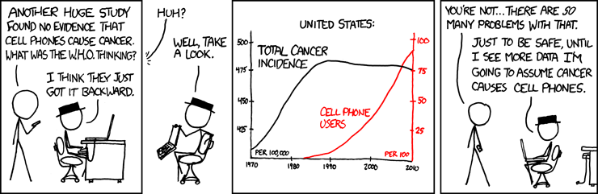
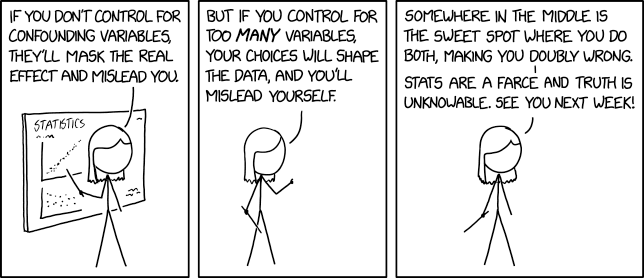
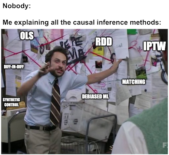
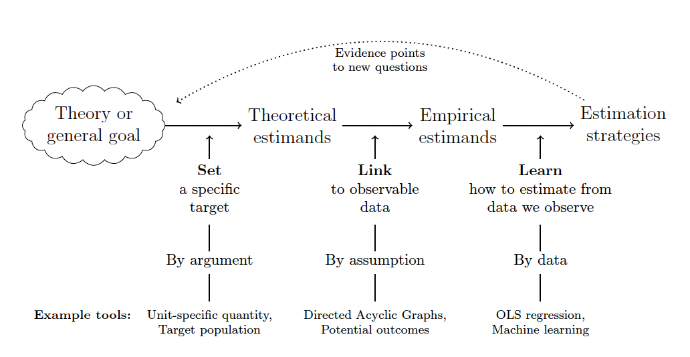
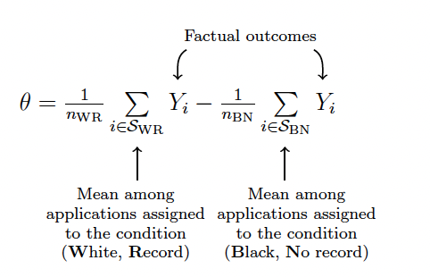

## Causation

::: incremental
-   You have surely heard "Correlation is not causation" before

    -   True enough, but also a sort of lazy criticism of quantitative research

-   Last \~20-30 years, incredible effort to isolate and measure credible causal effects

-   That will be the focus of the second half of the class

    -   But first let's look at some funny xkcd comics
:::

## Comic

{fig-align="center" width="100%"}

## Comic

{fig-align="center"}

## Comic

{fig-align="center"}

## What the rest of the semester will be

{fig-align="center" width="100%"}

## Why Causal Inference?

::: incremental
-   Pre 'Credibility Revolution' social science

    -   Garbage can regression: throw everything in there and hope for the best

        -   A good chance that, if you were an undergrad social science major, this is what you learned!

        -   But...not even clear what we are estimating?

-   Data + Assumptions = Conclusions

    -   Causal inference is about transparency in assumptions + more robust conclusions

    -   And being more explicit about *what we estimate*
:::

## Why Should MPAs Care?

::: incremental
-   Policy reports you read will use this language — ATE, counterfactual, selection bias

-   Grant proposals and program evaluations require causal reasoning

-   Understanding these ideas helps you be a **better consumer** of evidence, even if you never run a regression again

-   And if you do run regressions — this framework tells you *when to trust them*
:::

## Causal Inference Readings

-   Different than first part of the semester on specific statistical methods

-   More applied readings, posted to Canvas

-   Two very user friendly books

    -   honestly fun, almost breezy, reads (for academic books)

    -   Cunningham: Grad(+) level text, Potential Outcomes

    -   Huntington-Klein: Upper undergrad/Intro grad level, DAGs

## Today's Roadmap

::: incremental
1.  **Counterfactuals and Potential Outcomes** — the language of causal inference
2.  **Average Treatment Effects** — what we're trying to estimate (and why it's hard)
3.  **Randomization Inference** — generating p-values from random assignment
4.  **Estimands** — setting your target before you estimate
5.  **DAGs** — drawing your causal story
6.  **Identification** — figuring out what to control for
7.  **Mediation** — understanding *how* causes work
:::

## Semester Roadmap

::: incremental
-   This week: notation and theory

-   Next week: causal inference with observational data (fixed effects)

-   Then — various design-based approaches to causal inference

    -   Experiments (Natural, Survey, Lab)

    -   Diff-in-Diff

    -   RDD

    -   IV
:::

# Part 1: Counterfactuals

## What is causal inference?

::: incremental
-   Does increasing the minimum wage increase the unemployment rate?

    -   We observe that after the minimum wage is raised, unemployment goes up

    -   **Counterfactual**: What *would have happened* to unemployment without the minimum wage increase?

-   Does having a daughter make judges more likely to give pro-choice rulings?

    -   A judge with a daughter gives a pro-choice ruling

    -   **Counterfactual:** What *would that same judge have ruled* with no daughter?
:::

## The Key Idea

::: {.callout-note}
## Counterfactuals in Plain English
A **counterfactual** is the answer to: "What would have happened if things had been different?" Every causal claim is really a comparison between what *did* happen and what *would have* happened under a different scenario.
:::

. . .

We can never directly observe the counterfactual — and that is the central challenge of all causal inference.

## What is causation?

::: incremental
-   Early steps: Mill's methods

    -   "If a person eats a particular dish, and dies...and would not have died had he not eaten it...the dish was the source of his death"

    -   Method of Difference: All equal but the treatment

-   Today: Counterfactuals and DAGs

    -   Causation can be probabilistic, not deterministic

    -   Treatments can have heterogeneous effects
:::

## The Fundamental Problem of Causal Inference

::: incremental
-   Holland (1986) identifies the fundamental problem of causal inference:

    -   **For each unit, we only observe one potential outcome**

    -   We either see what happened with the treatment, or without it — never both

-   So how can we make inferences about the outcome we *didn't* see?

-   We come up with strategies for identifying these effects under a more or less plausible set of assumptions
:::

# Part 2: The Potential Outcomes Framework

## Example: Political Canvassing {.smaller}

::: incremental
-   Study *n* voters

    -   $n_{1}$ are canvassed (visited by door knockers)

    -   $n_{0}$ = $n - n_{1}$ are not canvassed

-   For each voter $i$, we observe an outcome

    -   $Y_{i}$ = Turnout (did they vote?)

    -   Treatment Variable: $$D_i =
        \begin{cases}
        1 & \text{if treated (canvassed)} \\
        0 & \text{if control (not canvassed)}
        \end{cases} $$
:::

## Potential Outcomes Notation

Potential outcomes give structure to our counterfactuals (Neyman 1923, Rubin \~ 1975)

::: incremental
-   $Y_{i}(1)$: outcome that unit *i* **would have** if treated

-   $Y_{i}(0)$: outcome that unit *i* **would have** if not treated
:::

. . .

::: {.callout-note}
## The Switching Equation
$$Y_{i} = D_{i} \cdot Y_{i}(1) + (1 - D_{i}) \cdot Y_{i}(0)$$
**In English:** We observe the potential outcome that matches your actual treatment status. If you were treated ($D_i = 1$), we see $Y_i(1)$. If not ($D_i = 0$), we see $Y_i(0)$. The other potential outcome is forever hidden from us.
:::

## The Causal Effect

The **causal effect** for unit *i* is simply the difference between the two potential outcomes:

$$\tau_i = Y_i(1) - Y_i(0)$$

. . .

::: {.callout-note}
## In English
The causal effect is: "How much better (or worse) off is this person because they received the treatment?" But we can **never observe this** for any individual, because we only see one of the two potential outcomes.
:::

## God's Table — What We Wish We Had

| Voter | Age $X_{i}$ | Contact $D_i$ | Turnout $Y_i(1)$ | Turnout $Y_i(0)$ | Causal effect $Y_i(1) - Y_i(0)$ |
|------------|------------|------------|------------|------------|------------|
| 1 | 25 | 1 | 0 | ??? | ??? |
| 2 | 38 | 0 | ??? | 1 | ??? |
| 3 | 67 | 0 | ??? | 0 | ??? |
| ⋮ | ⋮ | ⋮ | ⋮ | ⋮ | ⋮ |
| n | 43 | 1 | 1 | ??? | ??? |

The "???" cells are the fundamental problem. We never get to fill them in.

## A Worked Example: Surgery vs Chemo {.smaller}

::: incremental
-   Imagine a certain type of cancer has two treatments: surgery or chemotherapy

    -   Surgery: $D_{i} = 1$ ; Chemo: $D_{i} = 0$

    -   Outcome $Y_{i}$: years lived post treatment

-   Imagine that (by some miracle) we had potential outcome data for ten patients

    -   $E[Y^{1}] = 5.6$, $E[Y^{0}] = 5$

    -   So the **true ATE** $= 0.6$ years — surgery adds about 7 months on average
:::

## The Full Potential Outcomes Table

::: {style="font-size: 70%;"}
| Patient | $Y^S$ (Surgery) | $Y^C$ (Chemo) | $\delta = Y^S - Y^C$ |
|---------|-------|-------|----------------------|
| 1       | 7     | 1     | 6                    |
| 2       | 5     | 6     | -1                   |
| 3       | 5     | 1     | 4                    |
| 4       | 7     | 8     | -1                   |
| 5       | 4     | 2     | 2                    |
| 6       | 10    | 1     | 9                    |
| 7       | 1     | 10    | -9                   |
| 8       | 5     | 6     | -1                   |
| 9       | 3     | 7     | -4                   |
| 10      | 9     | 8     | 1                    |
:::

Notice: the treatment effect is **different for every patient.** Some benefit hugely from surgery, others are harmed by it.

## But Here's What We Actually See

::: {style="font-size: 60%;"}
| Patient | $Y$ | $D$ |
|---------|-----|-----|
| 1       | 7   | 1   |
| 2       | 6   | 0   |
| 3       | 5   | 1   |
| 4       | 8   | 0   |
| 5       | 4   | 1   |
| 6       | 10  | 1   |
| 7       | 10  | 0   |
| 8       | 6   | 0   |
| 9       | 7   | 0   |
| 10      | 9   | 1   |
:::

A doctor assigns each patient to whatever treatment seems "best" for them. What would our naive estimate of the surgery effect be?

## Average Treatment Effects

The **average treatment effect (ATE)** is the average causal effect across all units:

$$ATE = E[Y_{i}(1)] - E[Y_{i}(0)]$$

. . .

::: {.callout-note}
## In English
The ATE answers: "If we could give **everyone** the treatment and also give **everyone** the control, and compare, what would the average difference be?" We can never calculate this directly — but we can try to estimate it.
:::

## Average Treatment Effect on the Treated (ATT) {.smaller}

Sometimes we focus only on those who actually received the treatment:

$$ATT = E[Y_{i}(1) - Y_{i}(0) \mid D_{i} = 1]$$

. . .

::: {.callout-note}
## In English
The ATT answers: "Among the people who actually got treated, how much did the treatment help them on average?" This is often different from the ATE — because the people who get treated aren't a random sample. Sicker patients get surgery, motivated students seek tutoring, etc.
:::

. . .

There's also an **ATU** (Average Treatment Effect on the Untreated) — same logic, but for those who *didn't* receive treatment.

## Why Can't We Just Compare Averages? {.smaller}

What we *want* is the ATE. What we can *calculate* from data is the difference in observed outcomes between the treated and untreated groups.

. . .

$$\underbrace{E[Y|D = 1] - E[Y|D = 0]}_{\text{What we observe}} = \underbrace{ATE}_{\text{What we want}} + \underbrace{E[Y^{0}|D = 1] - E[Y^{0}|D = 0]}_{\text{Selection Bias}} + \underbrace{(1 - \pi)(ATT - ATU)}_{\text{Heterogeneous Effect Bias}}$$

## What Do These Bias Terms Mean?

::: incremental
-   **Selection Bias**: The treated and untreated groups were different *before* treatment
    -   In our surgery example: sicker patients get surgery, so the surgery group would have done worse *even without surgery*

-   **Heterogeneous Effect Bias**: The treatment works differently for different people, and the people who get treated aren't representative
    -   Surgery might be most beneficial for the sickest patients — but those are the ones who got it

-   **The takeaway**: Naive comparisons can be wildly misleading when treatment isn't random
:::

## The Independence Assumption

If the treatment is *independent of the potential outcomes*:

$$(Y^{1}, Y^{0}) \perp D_{i}$$

. . .

::: {.callout-note}
## In English
This means: "Who gets treated has nothing to do with how they would respond to treatment." If this holds, both bias terms vanish and the simple comparison of averages **is** the ATE.
:::

. . .

When is this realistic? **Randomized experiments** — and that's basically it. Everything else requires more assumptions.

## SUTVA {.smaller}

The other key assumption: **Stable Unit Treatment Value Assumption**

::: incremental
-   Each unit receives the same "dose" of treatment

-   No **spillover** to other units' potential outcomes

-   No **general equilibrium** effects

-   **Policy examples of SUTVA violations:**
    -   Vaccinating one person protects their neighbors (spillover)
    -   A job training program helps participants but crowds out non-participants (general equilibrium)
    -   Minimum wage increases affect untreated workers through price changes

-   If violated, we're not hopeless — there are strategies we'll cover later
:::

# Part 3: Randomization Inference

## A Different Way to Think About Uncertainty

::: incremental
-   In causal studies, we're often not trying to generalize to a larger population

    -   The core uncertainty is **not based on sampling** but on the fact that **we don't know the counterfactual**

-   **Randomization inference** generates p-values directly from the randomization itself

    -   Non-parametric: no assumptions about distributions

    -   Logic is somewhat similar to the bootstrap
:::

## The Lady Tasting Tea (Again)

::: incremental
-   Biologist Muriel Bristol claimed she could tell whether tea or milk was added first to a cup.

-   Statistician R.A. Fisher was skeptical, so he devised a test:

    -   Make 8 cups of tea, 4 each way

    -   Present cups in random order; ask Bristol to pick which 4 are milk-first

-   She picked all of them correctly.

-   There are $\binom{8}{4} = 70$ ways to choose 4 cups from 8, and only one way to get them all right

-   So the probability of guessing all correct by chance: $p = 1/70 \approx 0.014$
:::

## Fisher's Sharp Null

::: incremental
-   Fisher's null hypothesis is **sharp**: the treatment has *no effect on any unit*

    -   Every single person's outcome is the same regardless of treatment

-   This lets us generate **counterfactual outcomes** by simply reshuffling who got treated

-   **The procedure:**
    1.  Compute the observed test statistic (e.g., difference in means)
    2.  Randomly reshuffle treatment assignments many times
    3.  Recompute the test statistic for each reshuffling
    4.  Compare: how often does the reshuffled statistic look as extreme as what we observed?
:::

## An Example With Your Classmates {.smaller}

```{r}
#| echo: false
knitr::kable(
  data.frame(
    Student = c("Kris", "Yucheng", "Mariam", "Silvia", "Mayowa", "Ade", "Esnaina", "Matt", "Amelia", "Gigi", "Kazeem", "Will", "Vaiva", "Joe", "Amira", "Natan"),
    `Satisfaction Score` = c(7, 8, 6, 8, 8, 5, 7, 6, 9, 4, 7, 6, 9, 5, 8, 7),
    Treatment = c("Online", "In-Person", "In-Person", "In-Person", "Online", "Online", "Online", "Online", "Online", "In-Person", "In-Person", "Online", "In-Person", "Online", "In-Person", "Online")
  ),
  format = "markdown"
) %>%
  kableExtra::kable_styling(font_size = 15)
```

Students are randomly assigned to online or in-person. Is there a real difference in satisfaction?

## Randomization Inference in R {.smaller}

```{r}
#| echo: true

library(tidyverse)

course_data <- data.frame(
  Student = c("Kris", "Yucheng", "Mariam", "Silvia", "Mayowa", "Ade",  "Esnaina", "Matt", "Amelia", "Gigi", "Kazeem", "Will", "Vaiva", "Joe", "Amira", "Natan"),
  Satisfaction_Score = c(7, 8, 6, 8, 8, 5, 7, 6, 9, 4, 7, 6, 9, 5, 8, 7),
  Treatment = c("Online", "In-Person", "In-Person", "In-Person", "Online", "Online", "Online", "Online", "Online", "In-Person", "In-Person", "Online", "In-Person", "Online", "In-Person", "Online")
)

# Step 1: Compute the observed difference in means
observed_means <- course_data %>%
  group_by(Treatment) %>%
  summarise(Mean_Score = mean(Satisfaction_Score))

observed_diff <- observed_means$Mean_Score[observed_means$Treatment == "Online"] -
                 observed_means$Mean_Score[observed_means$Treatment == "In-Person"]
```

## The Permutation Loop {.smaller}

```{r}
#| echo: true

set.seed(30317)  # For reproducibility

# Step 2: Reshuffle treatment labels 1000 times
num_permutations <- 1000
random_diffs <- rep(0, num_permutations)

for (i in 1:num_permutations) {
  # Shuffle treatment labels randomly
  shuffled_treatment <- sample(course_data$Treatment)

  # Compute mean difference for shuffled data
  shuffled_means <- course_data %>%
    mutate(Treatment = shuffled_treatment) %>%
    group_by(Treatment) %>%
    summarise(Mean_Score = mean(Satisfaction_Score))

  random_diffs[i] <- shuffled_means$Mean_Score[shuffled_means$Treatment == "Online"] -
                     shuffled_means$Mean_Score[shuffled_means$Treatment == "In-Person"]
}

# Step 3: How often is the shuffled difference as extreme as what we observed?
p_value <- mean(abs(random_diffs) >= abs(observed_diff))
print(p_value)
```

## When to Use Randomization Inference

::: incremental
-   **Use it when** treatment is truly randomized and you want exact, assumption-free p-values

-   **Especially useful** with small samples where normal approximations may fail

-   **Don't use it** for observational data — the logic depends on actual randomization

-   **Limitation:** Fisher's sharp null tests whether the treatment had *zero effect on everyone* — it doesn't directly estimate the size of the effect
:::

# Part 4: Setting the Target — Estimands

## What Are You Trying to Estimate?

::: incremental
-   An **estimand** is your target quantity — the thing your study is trying to learn

-   Lundberg et al (2021) argue: set your estimand *before* you pick a model

    -   Don't define your research question as "a coefficient in a regression"

    -   Define it as a quantity in the real world, then figure out how to measure it

-   **Two components:**
    1.  A **unit-specific quantity** (e.g., "Would this person be employed if they received job training?")
    2.  A **target population** (e.g., "All working-age adults in South Carolina")
:::

## The Estimand Flowchart

{fig-align="center" width="100%"}

## Example Estimand

{fig-align="center" width="100%"}

How would you move from this theoretical estimand to something you could actually measure?

## Unit-Specific Quantities

Pager (2003) studied how race and criminal record impact employment outcomes

**Design:** Real job postings are randomly assigned to pairs of applications — applicants are either Black or White, and either have a felony conviction or not.

**Think about:** What is the unit of analysis here? What is the unit-specific quantity?

## Pager's Results

{fig-align="center" width="100%"}

## Target Populations

::: incremental
-   Angrist and Evans (1998) examined the effect of having three versus two children on women's employment

    -   Used having two children of the same sex as an instrument for having a third birth (more on IV later)

-   What is the target population here?

    -   Not all women — only women who would be *induced* to have a third child because their first two were the same sex

-   **This matters for policy:** the effect might not generalize to all families
:::

## Theoretical vs. Empirical Estimands

::::: columns
::: {.column width="50%"}
{fig-align="center"}
:::

::: {.column width="50%"}
{fig-align="center"}
:::
:::::

# Part 5: DAGs — Mapping Your Causal Story

## What Are DAGs?

::: incremental
-   **Directed Acyclic Graphs** — a visual tool for laying out your causal model

    -   **Directed**: arrows show the direction of causation

    -   **Acyclic**: no feedback loops (A can't cause B which causes A)

        -   If you think there's a feedback loop, you can use **time** to break the cycle

-   Incredibly useful for:
    -   Making your assumptions explicit
    -   Figuring out what to control for
    -   Justifying your research design to readers and reviewers
:::

## DAGs in R {.smaller}

Two popular packages:

::: incremental
-   `dagitty` — powerful, has a browser-based version too
-   `ggdag` — uses ggplot syntax, prettier output
:::

. . .

```{r}
#| echo: true

library(dagitty)
library(tidyverse)

dag <- dagitty("dag {
  Size -> Scores
  Funding -> Size
  Funding -> Scores
}")

plot(dag)
```

## The Same DAG With ggdag

```{r}
#| echo: true

library(ggdag)

dag <- dagify(
  Scores ~ Size + Funding,
  Size ~ Funding,
  exposure = "Funding",
  outcome = "Scores"
)

ggdag(dag, text = FALSE, use_labels = "name") +
  theme_dag() +
  coord_cartesian(clip = "off") +
  theme(
    plot.margin = margin(t = 20, r = 10, b = 10, l = 10),
    legend.position = "none"
  )
```

## What Goes in a DAG?

::: incremental
-   Focus on the **important stuff** — most beginners put too much in their DAGs!

-   Start with **all causes of your outcome**

-   Anything your outcome causes can usually be ignored

-   You are making *assumptions* about relationships when you draw (or don't draw) an arrow

    -   This should be based on careful thought, theory, and prior research
:::

## The Three Building Blocks {.smaller}

Every DAG is built from three simple structures. Understanding these is the key to knowing what to control for.

. . .

**1. The Chain (Mediation):** A → B → C

If you want the *total* effect of A on C, **don't** control for B.

. . .

**2. The Fork (Confounding):** A ← C → B

C creates a spurious association between A and B. **Control for C** to remove the bias.

. . .

**3. The Collider:** A → C ← B

A and B are independent. But if you **control for C**, you create a false association between A and B. *Don't* control for colliders!

## Chain Example: Slippery Sidewalks

```{r}
library(dagitty)

dag <- dagitty('
dag {
  Slippery [pos="0,2"]
  Wet [pos="0,1"]
  Rain [pos="-1,0"]
  Sprinkler [pos="1,0"]
  Season [pos="0,-1"]

  Wet -> Slippery
  Rain -> Wet
  Sprinkler -> Wet
  Season -> Rain
  Season -> Sprinkler
}
')

plot(dag)
```

## Fork Example: Mutual Dependence

```{r}
dag <- dagitty('
dag {
  A [pos="-1,0"]
  B [pos="1,0"]
  C [pos="0,1"]

  C -> B
  C -> A
}
')
plot(dag)
```

A and B are not causally related, but they are **not independent** because C creates an association between them. Control for C to break the spurious link.

## Collider Example: PhD Admissions

```{r}
dag <- dagitty('
dag {
  A [pos="-1,0"]
  B [pos="1,0"]
  C [pos="0,1"]

  A -> C
  B -> C
}
')
plot(dag)
```

. . .

::: {.callout-warning}
## The Collider Trap
Research Experience → Admission ← GRE Score. Among all applicants, GRE and research experience are unrelated. But if you only look at *admitted students* (conditioning on the collider), you'll find a negative correlation — because admitted students with low GRE scores must have had great research experience, and vice versa.
:::

## Unobserved Variables

We use $U$ for variables we can't measure but believe exist. These are often the source of our biggest identification headaches.

```{r}
library(dagitty)

dag <- dagitty('
dag {
  U [unobserved, pos="-2,-1.5"]
  Aptitude [pos="-1,-3"]
  Parental_Income [pos="-1,-1"]
  Education [pos="1,-1.5"]

  U -> Aptitude
  U -> Parental_Income
  Aptitude -> Education
  Parental_Income -> Education
}
')

plot(dag)
```

## Building a DAG: Online Classes and Dropout {.smaller}

Imagine we want to know: **Does taking online classes make students more likely to drop out?**

What variables matter? Let's think through it together...

. . .

```{r}
library(dagitty)

dag <- dagitty('
dag {
  Gender [pos="-3,2"]
  Race [pos="-3,1"]
  SES [pos="-2,1"]
  Academics [pos="-2,0"]
  WorkHours [pos="-3,3"]
  AvailableTime [pos="-2,3"]
  Preferences [pos="-1,2"]
  Age [pos="-1,1"]
  OnlineClass [pos="1,2"]
  InternetAccess [pos="2,2"]
  Location [pos="2,0"]
  Dropout [pos="3,1"]

  U1 [pos="-4,1"]
  U2 [pos="-4,0"]
  U3 [pos="-4,2"]
  U4 [pos="-4,3"]
  U5 [pos="1,-1"]

  Gender -> Preferences
  Gender -> WorkHours
  Gender -> Dropout
  Gender -> AvailableTime
  Race -> Preferences
  Race -> Dropout
  Race -> WorkHours
  Race -> AvailableTime
  SES -> Dropout
  SES -> Preferences
  SES -> InternetAccess
  SES -> AvailableTime
  SES -> WorkHours
  Academics -> Dropout
  Academics -> WorkHours
  Preferences -> OnlineClass
  WorkHours -> AvailableTime
  AvailableTime -> OnlineClass
  AvailableTime -> Dropout
  Age -> Dropout
  Age -> Preferences
  Age -> SES
  Age -> AvailableTime
  Age -> WorkHours
  OnlineClass -> Dropout
  InternetAccess -> Dropout
  Location -> InternetAccess

  U1 -> Race
  U1 -> Academics
  U2 -> Race
  U2 -> SES
  U3 -> Gender
  U3 -> Academics
  U4 -> Gender
  U4 -> SES
  U5 -> Location
  U5 -> SES
}
')

plot(dag)
```

## Simplifying DAGs

::: incremental
-   **Unimportant Variables:** If the effect sizes are likely very small, probably safe to remove

-   **Redundancy:** If variables have the same arrows in and out, group them together

-   **Mediators:** If B only connects to C through A → B → C, we can simplify to A → C

-   **Irrelevance:** If a variable isn't on any path between treatment and outcome, remove it
:::

## Simplified Version

```{r}
library(dagitty)

dag <- dagitty('
dag {
  U3 [pos="-4,2"]
  U4 [pos="-4,1"]
  U5 [pos="-1,0"]

  Demographics [pos="-2.5,2"]
  Academics [pos="-3,3"]
  SES [pos="-2,1.5"]
  WorkHours [pos="-1,3"]
  Age [pos="0,3"]
  OnlineClass [pos="1,2"]
  Location [pos="1,0"]
  Dropout [pos="3,1"]

  U3 -> Academics
  U3 -> Demographics
  U4 -> Demographics
  U4 -> SES
  U5 -> Location
  U5 -> SES

  Academics -> WorkHours
  Academics -> Dropout
  WorkHours -> OnlineClass
  Age -> Dropout
  Age -> WorkHours
  Age -> SES
  Age -> OnlineClass
  SES -> OnlineClass
  Location -> Dropout
  OnlineClass -> Dropout
  Demographics -> OnlineClass
  Demographics -> Dropout
}
')

plot(dag)
```

## What About Feedback Loops?

```{r}
library(igraph)

edges <- c("A", "B", "B", "C", "C", "A")
g <- graph(edges, directed = TRUE)
plot(g, vertex.size=30, vertex.label.cex=2, edge.arrow.size=0.5)
```

This is **not** a DAG — everything causes everything else. Solution: use **time** to break the cycle.

## Using Time to Break Cycles

```{r}
library(dagitty)
dag <- dagitty('dag {
  "IPunchYou_t" -> "YouPunchMe_t+1"
  "IPunchYou_t" -> "IPunchYou_t+1"
  "YouPunchMe_t+1" -> "IPunchYou_t+2"
  "IPunchYou_t+1" -> "IPunchYou_t+2"
}')

plot(dag)
```

Example from Huntington-Klein — once we add time subscripts, the cycle becomes a chain!

# Part 6: Using DAGs for Identification

## Paths

::: incremental
-   A **path** is any route between two variables, following arrows in *either* direction

-   You don't have to follow the arrow direction to trace a path

-   Variables may be connected by **multiple paths**

-   To figure out whether your estimate is biased, you need to identify *all* paths between treatment and outcome
:::

## How Many Paths? {.smaller}

```{r}
library(dagitty)

dag <- dagitty('dag {
  A -> B
  B -> C
  D -> E
  D -> C
  E -> A
  E -> B
}')

plot(dag)
```

How many paths are there from A to C?

## Front-Door and Back-Door Paths {.smaller}

::: incremental
-   **Front-door (good) paths**: Arrows flow from treatment → outcome. These represent the causal effect you want to measure.

    -   Direct paths and mediated paths count as front-door

-   **Back-door (bad) paths**: At least one arrow points *toward* the treatment. These represent confounding — alternative explanations for why treatment and outcome are correlated.

-   **Your goal**: Close all back-door paths (by controlling for the right variables) while leaving front-door paths open
:::

## Confounding

```{r}
dag <- dagitty('
dag {
  C [pos="-1,0"]
  D [pos="1,0"]
  Y [pos="0,1"]

  C -> Y
  C -> D
  D -> Y
}
')
plot(dag)
```

C is a **confounder** — it causes both D and Y. If we don't control for C, the D→Y path is contaminated by the back-door path through C.

## Unobserved Confounding (The Bad Place) {.smaller}

```{r}
dag <- dagitty('
dag {
  U [pos="-1,0"]
  D [pos="1,0"]
  Y [pos="0,1"]

  U -> Y
  U -> D
  D -> Y
}
')
plot(dag)
```

If we **can't** control for U (because we can't observe it), our estimates of D→Y will be biased. This is when we need the design-based approaches we'll learn after spring break — experiments, DiD, RDD, IV.

## Confounding Example: Education and Earnings

```{r}
dag <- dagitty('
dag {
  Demographics [pos="-1,0"]
  Education [pos="1,0"]
  Earnings [pos="0,1"]
  Ability

  Demographics -> Education
  Demographics -> Earnings
  Ability -> Education
  Education -> Earnings
  Ability -> Earnings
}
')
plot(dag)
```

How many paths from Education to Earnings? What should we control for to get the causal effect?

## Two Strategies for Identification {.smaller}

```{r}
dag <- dagitty('
dag {
  C [pos="-1,0"]
  O [pos ="1,0.5"]
  D [pos="-1,0.5"]
  Y [pos="0,1"]

  C -> O
  C -> D
  D -> Y
  O -> Y
}
')
plot(dag)
```

. . .

**Strategy 1:** Control for **O** — "adjust for all causes of the outcome"

. . .

**Strategy 2:** Control for **C** — "balance the determinants of the treatment"

. . .

Both close the back-door path. Different strategies, same goal.

## Watch Out for Colliders {.smaller}

What do we need to condition on to get the effect of D on Y?

```{r}
dag <- dagitty('
dag {
  C [pos="-1,0"]
  U [pos ="-1.5,0.5"]
  D [pos ="0,0"]
  V [pos="-.5,0.5"]
  Y [pos="0.5,1"]

  U -> Y
  U -> C
  V -> C
  V -> D
  D -> Y
}
')

plot(dag)
```

. . .

C is a **collider** — controlling for it would *open* a back-door path rather than close one!

## A Harder Example {.smaller}

```{r}
dag <- dagitty('
dag {
  A [pos="-1.5,-1"]
  B [pos="-1.5,1.5"]
  C [pos="-1,2"]
  U [pos="-2,0.5"]
  D [pos="0,1"]
  V [pos="-1,-1.5"]
  Y [pos="0.5,1"]
  F [pos="0,-1"]
  G [pos="0.5,-2"]

  V -> F
  V -> A
  U -> B
  U -> A
  A -> D
  B -> D
  C -> D
  D -> Y
  F -> Y
  G -> Y
}
')

plot(dag)
```

Assume **U** and **V** are unobservable. Can we identify the effect of D on Y? What should we control for?

## Why Draw DAGs? {.smaller}

::: callout-important
## Charles Manski (1994)
**Negative identification** findings imply that statistical inference is fruitless: it makes no sense to try to use a sample of finite size to infer something that could not be learned even if the sample were of infinite size. **Positive identification** findings imply that one should go on...(ie, do research, collect data, pick appropriate models)
:::

. . .

Drawing a DAG forces you to think about identification *before* you run a regression. It might save you from making a serious mistake — or convince you that your research design is sound.

# Part 7: Mediation — How Does the Cause Work?

## Mediation vs Moderation

::: incremental
-   These are often confused — let's make the distinction clear

-   **Moderation** (= interaction effect): The *size* of the treatment effect changes depending on another variable
    -   "School funding improves test scores **more** in high-poverty districts"

-   **Mediation** (= causal mechanism): The treatment works *through* an intermediate variable
    -   "School funding → **smaller classes** → better test scores"
    -   Part of the effect of funding flows through class size
:::

## Mediation Example: Job Training

```{r}
dag <- dagitty('
dag {
  Job_Training [pos="-1,0"]
  Mental_Health [pos="-1,0.5"]
  Employment [pos="0,1"]
  Other_Factors [pos="-2,0.5"]

  Job_Training -> Mental_Health
  Job_Training -> Employment
  Mental_Health -> Employment
  Other_Factors -> Mental_Health
  Other_Factors ->  Employment
}
')
plot(dag)
```

## Decomposing the Effect {.smaller}

::: incremental
-   The **total effect** of job training on employment has two components:

    -   The **direct effect**: Training → Employment (e.g., learning new skills)

    -   The **indirect/mediated effect**: Training → Mental Health → Employment (e.g., feeling more confident leads to better interview performance)

-   **Why does this matter for policy?** If most of the effect flows through mental health, maybe a cheaper mental health intervention could achieve similar results!

-   The indirect effect is often called the **Average Causal Mediation Effect (ACME)** — it answers: "How much of the treatment's effect operates through the mediator?"
:::

## Warning: Mediation Is Hard

The mediated effect **looks at the effect on the mediator, not the treatment itself** — which creates a subtle problem.

::: incremental
-   Even if treatment is randomly assigned, the *mediator* usually isn't

-   So we need stronger assumptions than for a simple ATE

-   Nailing down a causal mechanism is **harder** than nailing down a causal effect

-   This is why mediation analysis is always **optional** — you don't need it for causal identification
:::

## Opposite-Signed Effects

```{r}
dag <- dagitty('
dag {
  MouthWash [pos="-1,0"]
  AlcoholExposure [pos="-1,0.5"]
  OralCancer [pos="0,1"]

  MouthWash -> AlcoholExposure
  MouthWash -> OralCancer
  AlcoholExposure -> OralCancer
}
')
plot(dag)
```

Mouthwash might *directly* reduce oral cancer risk (kills bacteria), but the alcohol in mouthwash might *increase* cancer risk. The direct and mediated effects go in opposite directions!

## Mediation in R: The `mediation` Package {.smaller}

Back to job training: Does the program increase employment, and does improved self-efficacy (job-seeking confidence) explain part of the effect?

```{r}
#| echo: true
#| eval: false

library(mediation)

# Step 1: Model the mediator as a function of treatment + covariates
model.m <- lm(job_seek ~ treat + depress1 + econ_hard
              + sex + age + occp + marital + nonwhite + educ + income,
              data = jobs)

# Step 2: Model the outcome as a function of treatment + mediator + covariates
model.y <- glm(work1 ~ treat + job_seek + depress1
                  + econ_hard + sex + age + occp + marital + nonwhite + educ
                  + income, family = binomial(link = "probit"), data = jobs)

# Step 3: Estimate the mediation effect
ACME <- mediate(model.m, model.y, sims = 1000,
                 boot = TRUE, treat = "treat", mediator = "job_seek")
summary(ACME)
```

## Mediation Results {.smaller}

```{r}
library(mediation)
model.m <- lm(job_seek ~ treat + depress1 + econ_hard
              + sex + age + occp + marital + nonwhite + educ + income,
              data = jobs)

model.y <- glm(work1 ~ treat + job_seek + depress1
                  + econ_hard + sex + age + occp + marital + nonwhite + educ
                  + income, family = binomial(link = "probit"), data = jobs)
ACME <- mediate(model.m, model.y, sims = 1000,
                 boot = TRUE, treat = "treat", mediator = "job_seek")
summary(ACME)
```

## How Robust Are These Results? {.smaller}

Since we can't be sure the mediator is "as good as random," we do a **sensitivity analysis**: what if there's an unobserved variable that affects both the mediator and the outcome?

```{r}
#| echo: true

sensitivity <- medsens(ACME, rho.by = 0.05, sims = 1000)
plot(sensitivity)
```

. . .

The x-axis shows different levels of unobserved confounding ($\rho$). If the ACME crosses zero at small values of $\rho$, our mediation result is fragile. If it takes a large $\rho$ to eliminate the effect, we're on firmer ground.

# Wrapping Up

## What We Covered Today

::: incremental
1.  **Counterfactuals** — causal claims are always comparisons to an unobserved alternative
2.  **Potential outcomes** — notation for making counterfactuals precise ($Y(1)$, $Y(0)$, ATE)
3.  **Selection bias** — why naive comparisons mislead when treatment isn't random
4.  **Randomization inference** — generating p-values directly from random assignment
5.  **Estimands** — define your target before you estimate
6.  **DAGs** — visual tools for mapping causal assumptions (chains, forks, colliders)
7.  **Identification** — using DAGs to figure out what to control for
8.  **Mediation** — understanding *how* causes work (and why it's hard)
:::

## What's Next

::: incremental
-   Next week: **Fixed effects** — using panel data to control for unobserved confounders

-   Then: **Design-based causal inference**
    -   Experiments (Natural, Survey, Lab)
    -   Difference-in-Differences
    -   Regression Discontinuity
    -   Instrumental Variables
:::

## For Your Capstone

::: {.callout-tip}
## Think About This Now
What is your **estimand**? Can you draw a **DAG** for your research question? What are the biggest threats to identification? Even if you're doing descriptive work, these tools help you think clearly about what your analysis can and can't tell us.
:::
