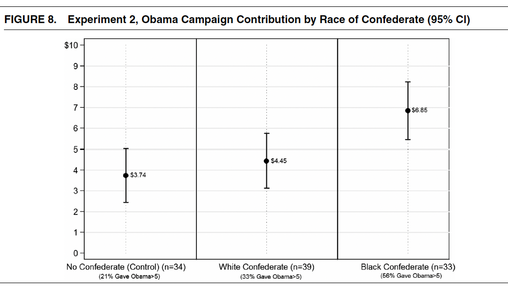
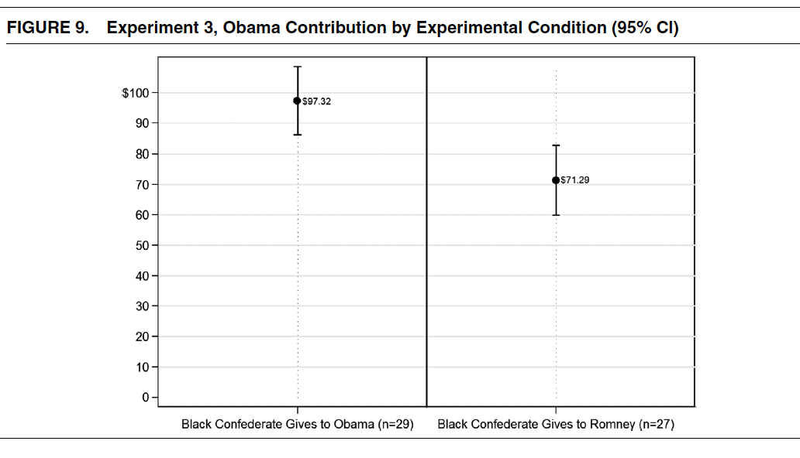
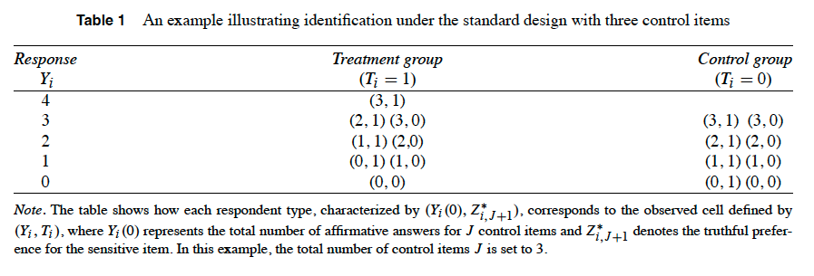
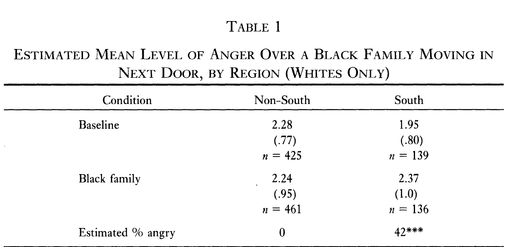
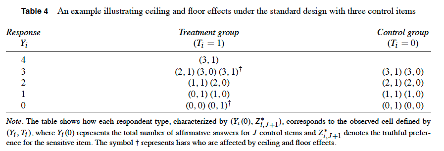
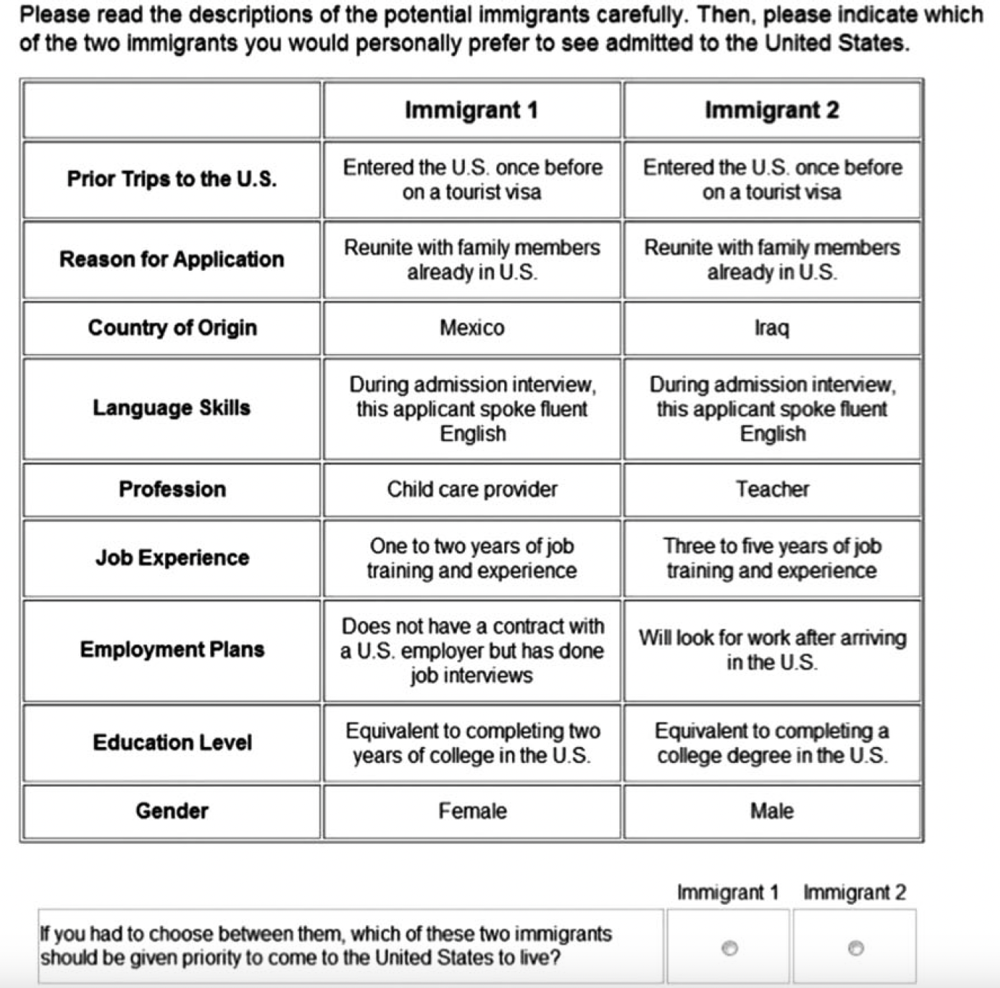

## What Is an Experiment?

::: incremental
-   Any research design where the **researcher controls the assignment of the treatment**

    -   A **randomized experiment** assigns treatment through some random procedure

-   If treatment is randomized, any difference in outcomes between groups can be attributed to a **causal effect**

    -   Counterintuitive: give up control over who is treated to *gain* insight into causality
:::

## Why Experiments Work

::: {.callout-note}
## Connecting to Last Week
Remember the **independence assumption**: $(Y^1, Y^0) \perp D_i$. If treatment is independent of potential outcomes, the simple difference in means **is** the ATE. Randomization *guarantees* this — no need to worry about selection bias or confounders.
:::

. . .

This is why experiments are considered the "gold standard" for causal inference. Everything else we'll learn this semester is about trying to approximate what an experiment gives you for free.

## Why Should MPAs Care?

::: incremental
-   Program evaluations increasingly require experimental or quasi-experimental evidence

-   Federal agencies (Education, HHS, Labor) now prefer RCTs for grant applications

-   Understanding experimental design helps you **evaluate evidence** in policy reports — even if you never run one yourself

-   And if you do run one, it could be the centerpiece of your career
:::

## Types of Experiments

::: incremental
-   **Lab Experiments:** Controlled settings, often involving games or tasks

    -   High internal validity, but may not reflect the real world

-   **Field Experiments / RCTs:** Real-world interventions with random assignment

    -   High external validity, but expensive and less control

-   **Survey Experiments:** Experimental treatments embedded in surveys

    -   Cheapest; but questions about whether survey responses match real behavior

-   **Natural Experiments:** Nature provides "as-if random" treatment assignment

    -   Lotteries, arbitrary cutoffs, historical accidents
:::

## The Core Tradeoff

**External Validity:** Do the results generalize beyond the specific context of your experiment?

. . .

If you run an RCT, does it generalize to other settings? If you run a survey experiment, do responses translate to real-world behavior?

. . .

**Internal Validity:** Does your experiment accurately capture the causal impact of the intervention?

. . .

Are your measurements valid? Are your treatments well-designed? Have you considered potential threats (SUTVA violations, attrition, non-compliance)?

## Today's Roadmap

::: incremental
1.  **Ethics** — what we owe experimental subjects
2.  **Designing an experiment** — from recruitment to analysis
3.  **Power analysis** — making sure your study can detect real effects
4.  **Pre-registration** — locking in your analysis before seeing results
5.  **Field, lab, and survey experiments** — with detailed examples
6.  **Natural experiments** — when nature does the randomizing for you
:::

# Part 1: Ethics of Experiments

## Tuskegee Syphilis Study

::: incremental
-   Between 1932–1972, the US government carried out the Tuskegee Syphilis Study

-   The government recruited subjects who had syphilis — all Black men — but **lied about the nature of the study**

    -   Rather than providing treatment, the study gave placebos and watched the disease progress. Over 100 subjects died.

-   Clearly unethical and criminal: inspired the modern framework of *informed consent* and focus on **potential harms**
:::

## Milgram Obedience Experiments

Psychologist Stanley Milgram wanted to study obedience to authority in light of WW2 atrocities.

. . .

**Design:** Participants were told they were in a study about learning and memory. Each was instructed to administer electric shocks to "students" (actually paid actors) for wrong answers.

. . .

As voltage increased, actors screamed in pain, but the experimenter insisted participants continue. The majority continued through the maximum voltage.

. . .

Some participants suffered lasting psychological trauma. This sparked major debates about the ethics of deception in research. (See also: the Stanford Prison Experiment)

## Informed Consent

::: incremental
-   Subjects should be made as aware of the **purpose of the experiment as possible**

-   **Deception** should be kept to the feasible minimum; if used, provide a debrief afterward

-   Participants must be informed of **potential risks**

-   Researchers must provide documentation of these factors plus contact information, and **obtain informed consent** (usually via signature)
:::

## The IRB Process

::: incremental
-   Clemson's Institutional Review Board: <https://www.clemson.edu/research/division-of-research/offices/orc/irb/>

-   IRBs exist to protect participants and the university from liability

    -   Not there to make your life easier, but an important part of the process

-   Before collecting **any data with human subjects** — even observational — you must get IRB approval

    -   Does not apply to using existing census or survey data, only if you're collecting new data (or rare other cases)
:::

## When Is Randomization Ethical?

::: incremental
-   One common situation: a program is **oversubscribed** and resources are limited

-   In these cases, **lotteries** or random draws assign individuals to treatment or control

    -   Example: Access to newly constructed affordable housing determined by lottery among eligible applicants

-   This is both fair (everyone has an equal chance) and scientifically useful (randomization → causal inference)
:::

# Part 2: Designing an Experiment

## Example: Does Exercise Reduce Colds? {.smaller}

::: incremental
-   We studied whether exercising more frequently causes fewer colds using observational data with fixed effects

    -   This might suffer from reverse causation or unobserved time-variant confounders

-   How could we design an experiment to test this relationship?

-   **Recruitment (n = 200):**
    -   Inclusion: Adults aged 18–60, self-report at least fair health, no severe chronic conditions
    -   Exclusion: No professional athletes, no one already exercising 5+ days/week, no current gym members
:::

## Treatment Assignment

::: incremental
-   Treatment group: free gym membership for 6 months

    -   **Treatment Monotonicity:** Getting a gym membership won't make anyone *less* likely to exercise

    -   **Appropriate Duration:** 6 months is enough time for health effects to manifest

-   Control group: health monitored, continue normal behavior

    -   **Hawthorne Effect:** Could being observed change control group behavior?
:::

## What to Measure

::: incremental
-   **Treatment:** Access to free gym (0/1)

-   **Dependent Variable:** Number of self-reported colds

    -   If measuring multiple outcomes, need to adjust for multiple hypothesis testing

-   **Optional Mediators:** Gym usage frequency, stress levels

-   **Optional Covariates:** Age, sex, race, health status
:::

## Analysis: The ATE as a Difference in Means

In an experiment, the ATE is simply the difference in average outcomes between groups:

$$ATE = E[Y | D = 1] - E[Y | D = 0]$$

::: {.callout-note}
## In English
Average outcome for the treatment group minus average outcome for the control group. Because treatment was randomly assigned, this simple comparison **is** the causal effect — no regression or fancy statistics needed.
:::

## Simulating the Experiment in R {.smaller}

```{r}
#| echo: true

library(tidyverse)
set.seed(30317)

n_per_group <- 100
n <- n_per_group * 2

# Fixed treatment assignment: 100 control, 100 treatment
treatment <- sample(c(rep(0, n_per_group), rep(1, n_per_group)))

# Pre-treatment covariates
sleep <- rnorm(n, mean = 7, sd = 1)
stress <- rnorm(n, mean = 5, sd = 2)
fitness <- rnorm(n, mean = 5, sd = 2)

# Outcome: more stress → more sickness, more sleep/fitness → less
linear_predictor <- 1.5 - 0.2 * sleep + 0.25 * stress - 0.15 * fitness - 0.5 * treatment
lambda <- exp(linear_predictor)
sick_count <- rpois(n, lambda = lambda)

df <- data.frame(id = 1:n, treatment, sleep, stress, fitness, sick_count)
```

## Balance Check {.smaller}

Before looking at outcomes, verify that randomization produced similar groups:

```{r}
#| echo: true

# Compare covariate means across groups
colMeans(df[df$treatment == 0, c("sleep", "stress", "fitness")])
colMeans(df[df$treatment == 1, c("sleep", "stress", "fitness")])
```

. . .

Or more formally:

```{r}
#| echo: true
#| eval: false

t.test(sleep ~ treatment, data = df)
t.test(stress ~ treatment, data = df)
t.test(fitness ~ treatment, data = df)
```

If there are significant differences, you can control for the covariate — but it also suggests your randomization may have gone wrong!

## The Simple t-Test

```{r}
#| echo: true

t.test(sick_count ~ treatment, data = df)
```

. . .

::: callout-important
What is the precise interpretation here? What is the causal effect we are estimating?
:::

## Should We Include Covariates? {.smaller}

::: incremental
-   **Arguments for** including covariates in a regression:
    -   Increases precision and statistical power
    -   Accounts for any residual imbalance
    -   Allows exploration of heterogeneous effects

-   **Arguments against:**
    -   Simplicity of interpretation is better without covariates
    -   Randomization already handles confounding
    -   Overfitting risk with small samples
:::

## My Take

::: incremental
-   Pick your approach in the **pre-registration** and stick to it

    -   You lose credibility if you switch your analysis strategy after seeing results

-   Generally, I prefer the simple t-test, even at the cost of some power

    -   But either approach is fine

-   If you have strong reason to suspect covariates matter, regression can help detect heterogeneous effects
:::

## Regression With Covariates {.smaller}

```{r}
#| echo: true

model_with <- lm(sick_count ~ treatment + sleep + stress + fitness, data = df)
summary(model_with)
```

## Compare: Regression Without Covariates {.smaller}

```{r}
#| echo: true

model_without <- lm(sick_count ~ treatment, data = df)
summary(model_without)
```

. . .

The standard error is about 30% bigger without covariates — maybe the "include covariates" folks are on to something!

# Part 3: Power Analysis

## Selecting a Sample Size {.smaller}

::: incremental
-   **Statistical power** is the probability that your test will correctly reject the null hypothesis when a real effect exists

-   Before running an experiment, you need to ensure you have enough power to detect an effect of a reasonable size

    -   "Reasonable" should be defined by theory and prior work — not by what's convenient

-   **Key terms:**
    -   **Significance ($\alpha$):** Probability of a false positive. Usually set at 0.05.
    -   **Power ($1 - \kappa$):** Usually set at 0.80 (meaning 20% chance of missing a real effect)
    -   **Minimum Detectable Effect (MDE):** The smallest effect you can reliably detect given your sample size
:::

## What Increases Power?

::: incremental
-   **Larger sample size** → more power, smaller MDE

-   **Lower outcome variance** → more power (less noise)

-   **Larger true effect** → easier to detect

-   **Equal allocation** between treatment and control → most efficient use of your sample
:::

## Visualizing Power {.smaller}

```{r}
#| echo: false

library(ggplot2)

mu0 <- 0
mu1 <- 2
sd <- 1
alpha <- 0.05
z_alpha <- qnorm(1 - alpha, mean = mu0, sd = sd)
x <- seq(-4, 6, length.out = 1000)

df_power <- data.frame(
  x = rep(x, 2),
  density = c(dnorm(x, mean = mu0, sd = sd),
              dnorm(x, mean = mu1, sd = sd)),
  group = rep(c("H0", "H1"), each = length(x))
)

colors <- c("H0" = "#E74C3C", "H1" = "#1ABC9C")

ggplot(df_power, aes(x = x, y = density, color = group)) +
  geom_line(size = 1) +
  scale_color_manual(values = colors) +
  geom_vline(xintercept = z_alpha, linetype = "dashed", color = "goldenrod", size = 1) +
  geom_vline(xintercept = mu0, color = "#E74C3C", size = 0.5) +
  geom_vline(xintercept = mu1, color = "#1ABC9C", size = 0.5) +
  annotate("text", x = mu0 - 0.2, y = 0.35, label = "H[0]", parse = TRUE, color = "#E74C3C", size = 5) +
  annotate("text", x = mu1 + 0.2, y = 0.35, label = "H[1]", parse = TRUE, color = "#1ABC9C", size = 5) +
  annotate("text", x = mu0, y = -0.01, label = "0") +
  annotate("text", x = mu1, y = -0.01, label = "beta", parse = TRUE) +
  geom_area(data = subset(df_power, group == "H1" & x > z_alpha),
            aes(x = x, y = density), fill = "darkseagreen1", alpha = 0.6, inherit.aes = FALSE) +
  theme_minimal() +
  labs(x = NULL, y = NULL, color = NULL) +
  theme(legend.position = c(0.85, 0.85),
        axis.text.y = element_blank(),
        axis.ticks.y = element_blank())
```

The green shaded area is your **power** — the probability of correctly detecting the effect. If the true effect ($\beta$) is small or your sample is small, this area shrinks.

## The MDE Formula {.smaller}

Given a fixed sample size, the minimum detectable effect is:

$$MDE = (t_{1-\kappa} + t_{\alpha/2})\sqrt{\frac{1}{P(1-P)}} \times \frac{\sigma}{\sqrt{N}}$$

::: {.callout-note}
## In English
The MDE gets **smaller** (better) when you have a **bigger sample** ($N$), **less noisy outcomes** ($\sigma$), and **equal treatment/control splits** ($P = 0.5$). You can also flip this formula around to solve for the sample size you need to detect a given effect.
:::

. . .

Things get more complicated with block/cluster randomization, but the intuition is the same.

## Type S and Type M Errors {.smaller}

Small samples create two underappreciated problems beyond low power:

. . .

**Type S (Sign) Error:** The probability that your estimated effect has the **wrong sign** — you find a positive effect when the truth is negative, or vice versa.

. . .

**Type M (Magnitude) Error:** The **exaggeration ratio** — how much your significant estimates overstate the true effect. In small samples, only the most extreme estimates pass the significance threshold.

## Example: Why This Matters {.smaller}

::: incremental
-   Imagine the true effect of a program is **+2 points** on a test score

-   In a small study you might estimate **+10 points** with p = 0.04

    -   Wow, a big effect and statistically significant!

    -   But it's a **Type M error** — the estimate is 5x the truth

-   Run the same study again and you might get **–5 points**

    -   A **Type S error** — you got the direction wrong entirely

-   Traditional focus on p-values and Type I error **completely misses** these problems
:::

# Part 4: Pre-Registration

## Why Pre-Register?

::: incremental
-   One advantage of experiments is that they are harder to p-hack or fish for significance

    -   Limits "researcher degrees of freedom"

-   But you could still collect many outcomes and run multiple tests until you find something significant

    -   Don't do this!

-   Most good journals now require pre-registration of experimental analyses

    -   *APSR, AJPS,* all *AEA* journals, and many more
:::

## Registered Reports

::: incremental
-   Many journals now accept **registered reports**: a pre-analysis plan plus the literature and theory sections, but **no results**

-   The journal commits to publish regardless of whether results are significant

-   This de-incentivizes fishing for significance — make the case that the question is important and the design is sound!

-   Accepted at: *APSR, Journal of Experimental Political Science, Journal of Development Economics,* etc.
:::

## What Goes in a Pre-Analysis Plan

::: incremental
-   Complete information on the experimental design: treatments, recruitment, etc.

-   Complete information on what will be measured

-   Complete information on what analyses will be run and hypotheses tested

    -   Deviations from the plan are OK if transparent, but try to avoid them

-   Example: <https://osf.io/prk2t/?view_only=bf72ec263e764bab82a3c9817f96f84d>
:::

## Assignment Strategies {.smaller}

::: incremental
-   **Complete randomization** (coin flips) can produce unbalanced groups, especially in small samples

    -   You could even end up with everyone in one group!

-   **Controlled assignment:** Set quotas for group sizes, then randomly assign within those quotas

-   **Stratified assignment:** Group individuals by theoretically important characteristics, then randomize within each stratum
:::

. . .

```{r}
#| echo: false

library(gt)

data.frame(
  `Fitness Level` = c("High", "Low"),
  Treatment = c(10, 10),
  Control = c(10, 10)
) %>%
  gt() %>%
  tab_header(title = "Stratified Randomization Example")
```

. . .

Without stratification, you might end up with 15 high-fitness participants in treatment and only 5 in control.

# Part 5: Field Experiments

## Incentives Work: Getting Teachers to Come to School {.smaller}

::: incremental
-   **Background:** Teacher absenteeism is a major problem in rural India. Educational outcomes are poor.

    -   Seva Mandir runs single-teacher schools in rural India

    -   They try to minimize absenteeism by "berating" absent teachers — yet absenteeism remains high

-   **Question:** Can policymakers design an intervention to incentivize better teacher attendance?

    -   **Secondary Question:** Does higher teacher attendance improve student outcomes?
:::

## The Intervention

::: incremental
-   Seva Mandir gave 57 randomly selected teachers **cameras**, with instructions to have students take date-stamped photos with the teacher at the start and end of each day

-   Teachers received Rs. 500 if they attended fewer than 10 days, plus Rs. 50 for each additional day

    -   What is the logic of this payment structure?

-   Is this ethical? What are the considerations?
:::

## Preview of Results

::: incremental
-   Teacher attendance **increased significantly** in treatment schools

-   Test scores improved by about **0.2 standard deviations**

    -   A modest but detectable effect

-   After 2.5 years, children in the program were **62% more likely** to transfer to formal primary schools
:::

## Design Details

::: incremental
-   Duflo and co-authors partnered with Seva Mandir — a very common approach for field experiments

    -   Sometimes a way to find funding: provide free analysis for an NGO

    -   But don't outsource the work to the NGO. See the recent GDRI scandal in Bangladesh.

-   120 total schools, randomized. Some **attrition**: 3 treatment schools and 4 control schools closed during the study.
:::

## Treatment Details

::: incremental
-   Initial teacher wage: Rs. 1,000 (~$160 PPP) for a minimum of 20 days of work

    -   Treatment: Rs. 50 bonus (~$8 PPP) for each day over 20; Rs. 50 fine for each day under 20, fines capped at Rs. 500

-   Control group receives the initial wage with no incentive structure

-   Teachers reminded they could be dismissed for poor attendance

    -   But no teacher was actually fired during the evaluation. Why not?
:::

## Data Collection {.smaller}

::: incremental
-   Study done with J-PAL, one of the main funders of field experiments. They handled data collection.

-   Teacher attendance measured through **two unannounced visits per month:**
    -   How many students present? Anything on the blackboard? Was the teacher talking to children?
    -   Why are these good measures?

-   Seva Mandir provided camera and payment data

-   Three student exams administered: pretest, midtest, post-test
    -   Basic math and vocabulary
    -   Students who could not write received 0 on written portions
:::

## Baseline Data

{fig-align="center"}

## Baseline Balance

::: incremental
-   Similar proportions of students (17% treatment vs 19% control) took the written exam

-   Control group scored slightly higher on the oral exam; treatment slightly higher on written

    -   Neither difference close to significant — randomization worked!
:::

## Results: Attendance

{fig-align="center"}

This is simply the difference in % of schools open when randomly checked. Experiments allow for very simple inference!

## Results: Magnitudes

::: incremental
-   Attendance was **79%** for treatment teachers vs **58%** for control

    -   Difference of 0.21, SE = 0.03, p-value well under 0.05

-   Standard errors clustered by school (since treatment assigned at school level)

    -   Using parametric inference, but randomization inference would also work — should be specified in pre-registration!
:::

## The Incentive Structure in Action

{fig-align="center"}

Black line = teachers already "in the money." Red line = teachers not yet at the threshold. What does this tell us about how incentives work?

## Discussion

::: incremental
-   What are the **precise treatment effects** measured here?

    -   I count at least three distinct effects in this study

-   Are there potential threats to **internal validity**?

-   What about **external validity** — where might these results generalize? Where should we be skeptical?
:::

## Field Experiments: Pros and Cons

::: incremental
-   **Benefits:** Very high external validity; involves real interventions with real consequences

-   **Drawbacks:** Less control over treatments; more potential for internal validity issues; reliance on third parties; expensive (though funding exists)

-   **Resources:**
    -   <https://www.povertyactionlab.org/research-resources?view=toc>
    -   <https://www.povertyactionlab.org/page/handbook-field-experiments>
    -   Work with faculty! We have experience applying for grants and may lend credibility to applications
:::

# Part 6: Lab Experiments

## What Are Lab Experiments?

::: incremental
-   Can be true "lab" experiments or "lab-in-the-field" experiments

-   Recruit subjects to participate in a controlled experiment

-   Often involve games (see Fehr on Canvas; also "Why Does Ethnic Diversity Undermine Public Goods Provision?" by Habyarimana et al)

-   Greater control over treatments than field experiments, but less external validity
:::

## Example: Racial Group Norms and Political Behavior {.smaller}

White and co-authors wanted to test how much **social group norms** explain Black support for the Democratic Party.

. . .

::: callout-note
## Their Expectation
*We expect that Blacks are constrained from following strict self-interest by the social costs incurred when other Blacks question their commitment to or standing within the group. Moreover, we argue that such social pressure can be internalized, creating an individual belief in Black solidarity that is also constraining.*
:::

## Experiment 1: Financial Incentives vs. Social Visibility

::: incremental
-   **Sample:** 150 students from an HBCU

-   **Control:** Asked to donate $100 to Obama or Romney (or split)

-   **T1:** Same choice, but receive $1 for every $10 donated to Romney

-   **T2:** Same as T1, but name will appear in a newspaper as a Romney donor

-   Note: Due to state law, no money was actually allocated. Students were debriefed after. Is this deception acceptable?
:::

## Experiment 1 Results

{fig-align="center"}

## Experiment 2: Race of Observer

::: incremental
-   **Sample:** 106 Black students at a predominantly white university in the Midwest

    -   Why is varying the location useful?

-   Each student given $10 in dollar bills. Each dollar donated matched 10:1, or keep the money.

-   **T1:** Paired with a Black actor (same sex) who pretended to be a participant

-   **T2:** Paired with a White actor (same sex) who pretended to be a participant
:::

## Experiment 2 Results

{fig-align="center"}

## Experiment 3: Norm Violation by a Co-Ethnic

::: incremental
-   **Sample:** 56 Black students at a predominantly white school

-   Told that for every $10 donated to Romney, they'd receive $1

-   Always a Black actor present — in control the actor gives to Obama; in treatment the actor gives to Romney

-   What is this testing?
:::

## Experiment 3 Results

{fig-align="center"}

## What Did We Learn?

::: incremental
-   What are the **precise treatment effects** estimated across these three experiments?

-   Who is the sample — how might results generalize?

-   What are potential threats to inference?

-   The **WEIRD problem**: subjects are often Western, Educated, Industrialized, Rich, and Democratic — university students especially
:::

# Part 7: Survey Experiments

## Why Survey Experiments?

::: incremental
-   Embed experimental treatments directly in surveys

-   Obvious limitations: restricted to text, images, and (if interactive) videos or web apps

-   **Cheapest** way to run an experiment

-   Being embedded in a survey lets you collect lots of background data

-   External validity is the main concern — do survey responses match real behavior?

-   Mechanics: Code in Qualtrics (free through Clemson), pay for a sample. If you're serious about this, come talk to me!
:::

## List Experiments: Measuring Sensitive Attitudes

::: incremental
-   List experiments are useful for **eliciting sensitive or embarrassing information**

    -   Reduces chance of identification

    -   Allows respondents to indirectly reveal sensitive information

-   Imai et al have a nice R package (`list`) for analysis
:::

## The Basic Idea {.smaller}

Imagine you wanted to measure racial prejudice. You can't (or *shouldn't*) just ask someone directly.

. . .

Instead, embed the sensitive question in a **list** and ask respondents how many items they agree with — *not which ones*.

. . .

**Control group** sees $n - 1$ items (without the sensitive question). **Treatment group** sees all $n$ items. The difference in means = the proportion who agree with the sensitive item.

## Control Condition (from Imai 2012)

Now I'm going to read you **three** things that sometimes make people angry or upset. After I read all three, just tell me **HOW MANY** of them upset you. (I don't want to know which ones, just how many.)

(1) the federal government increasing the tax on gasoline

(2) professional athletes getting million-dollar-plus salaries

(3) large corporations polluting the environment

How many, if any, of these things upset you?

## Treatment Condition (from Imai 2012)

Now I'm going to read you **four** things that sometimes make people angry or upset. After I read all four, just tell me **HOW MANY** of them upset you. (I don't want to know which ones, just how many.)

(1) the federal government increasing the tax on gasoline

(2) professional athletes getting million-dollar-plus salaries

(3) large corporations polluting the environment

**(4) a Black family moving next door to you**

How many, if any, of these things upset you?

## Identification {.smaller}

{fig-align="center"}

. . .

The treatment effect estimate is:

$$\widehat{\tau} = \frac{1}{N_{1}}\sum_{i = 1}^{N}T_{i}Y_{i} - \frac{1}{N_{0}}\sum_{i = 1}^{N}(1 - T_{i})Y_{i}$$

::: {.callout-note}
## In English
This is just the **difference in average count** between the treatment group and the control group. Since the only difference between the lists is the sensitive item, this difference equals the **proportion of people who agree with the sensitive item** — without anyone having to reveal *which* items they chose.
:::

## Design Tips for List Experiments

Don't use items that are highly correlated with each other *or* with the sensitive item. Avoid items that *everyone* or *no one* will agree with.

. . .

**Key Assumption 1:** Including the sensitive item doesn't change respondents' answers to the other items

. . .

**Key Assumption 2:** Respondents don't lie about the sensitive item (even with the protection of the list format)

## Application: Racial Attitudes in the American South

Kuklinski et al (1997): By the 1990s, survey data suggested that racial attitudes among northern and southern whites were converging — racism in the South had massively declined. But **can we believe the survey data?**

. . .

They used a list experiment to tackle this question.

## Results

{fig-align="center"}

Anything suspicious here?

## Ceiling Effects

-   Some people (particularly in the control) say **all items** made them angry

    -   If so, they couldn't safely reveal additional anti-Black bias in the treatment condition

    

    This would lead to **underestimation** of the true proportion

## Dealing With Ceiling Effects

::: incremental
-   We need an additional assumption: respondents' answers to the sensitive item are independent of their answers to control items, conditional on covariates

-   Under this assumption, we can use pre-treatment covariates to predict who would have hit the ceiling and correct for it

-   The estimation method is complex (uses an EM algorithm — beyond our scope), but the intuition isn't too different from MLE

-   See Blair and Imai (2012) on Canvas for the full treatment
:::

## Conjoint Experiments {.smaller}

::: incremental
-   Many policy-relevant preferences are **multidimensional**

    -   What makes for a good political candidate? A good policy? A good neighborhood?

-   It would be nice to vary **many dimensions simultaneously and randomly**, and recover the causal effect of each one

-   This is what **conjoint experiments** do — and they're surprisingly powerful
:::

## Example Setup

Imagine designing the "perfect" political candidate. We could vary:

::: incremental
-   Age (25, 35, 45, 55, 65)
-   Race/Ethnicity (Black, White, Hispanic, Asian, Middle Eastern)
-   Ideology (very left, center left, center, center right, very right)
-   Prior Occupation (Lawyer, Business Person, Activist, Teacher, etc.)
:::

## A Conjoint Profile

| Attribute        | Candidate A | Candidate B        |
|------------------|-------------|--------------------|
| Ideology         | Progressive | Conservative       |
| Race             | Black       | White              |
| Age              | 45          | 60                 |
| Prior Occupation | Teacher     | Business Executive |

The respondent "votes" for one candidate. Profiles are **randomly generated**, so any systematic preference reveals causal effects.

## The AMCE: Average Marginal Component Effect

::: {.callout-note}
## In English
The AMCE tells you: "Holding all other attributes at their randomly assigned values, how much does changing **this one attribute** (say, from White to Black) change the probability that a candidate is chosen?" It's the average effect of one component, marginalizing over all the other profile features.
:::

. . .

The formal notation exists but is dense — the key insight is that because profiles are fully randomized, you can estimate causal effects for each attribute with a simple regression.

## Conjoint Assumptions

::: incremental
-   **Stability:** Same profiles → same choice (no random clicking)
-   **No profile order effects:** Respondents don't get fatigued across profile pairs
-   **Randomization of profiles:** All possible profiles have a non-zero chance of appearing
:::

## Immigration Conjoint Example

{fig-align="center"}

## Immigration Results

{fig-align="center"}

## Conjoint Considerations

::: incremental
-   Pretty amazing that you get that many causal effects from one experiment!

-   But some important caveats:
    -   Everything is conditional on the profiles presented and their probabilities
    -   Everything is relative to a **reference category** within each attribute
    -   What *precisely* are we estimating? The effect of seeing an attribute in a survey — not necessarily real-world behavior

-   External validity remains the key question
:::

## Subgroup Analysis

::: incremental
-   Since everything is relative to a reference group, subgroup analysis is relative to a reference group *within* a subgroup

    -   This can be hard to interpret!

-   Two strategies:
    -   Pick the most meaningful subgroup, be clear in interpretation
    -   Present **marginal means** instead — not relative to any baseline
:::

## Subgroup Results

{fig-align="center"}

# Part 8: Natural Experiments

## When Experiments Are Impossible

::: incremental
-   Often in the social sciences, we either **cannot manipulate** our treatment variable, or doing so would be unethical

-   With observational data, we face omitted variable bias, reverse causality, and unmeasured confounders

-   Sometimes, **nature provides the randomization** we need

    -   Lotteries, arbitrary cutoffs, close elections, historical accidents

-   The strength of these designs depends on the plausibility of treatment being **"as if random"**
:::

## The First Natural Experiment?

::: incremental
-   Cholera was a common and usually fatal disease in 19th century Europe

-   Experts believed it spread by **miasma** — bad air particles

    -   Quarantine-based treatments were largely ineffective

-   Physician **John Snow** noticed anomalies: one building devastated, the next door untouched. Sailors only got sick if they took on food and water.

-   He hypothesized that contaminated water from the Thames was to blame

    -   But how to prove it?
:::

## Snow's Research Design {.smaller}

::: incremental
-   Imagine you were a dictator with unlimited power. What would you do to test this?

    -   Force people to drink Thames water or not → **clearly unethical**

-   Instead, Snow found **natural variation** in water supply

-   In 1850, the **Lambeth** water company moved its intake pipes upstream from London (theoretically uncontaminated)

-   Rival company **Southwark and Vauxhall** kept its pipes in contaminated water

-   Can we compare cholera rates between the two companies' customers?

    -   What would we need to verify?
:::

## Establishing Exogeneity

Snow wrote an entire book documenting similarities between the two companies' households. Their service areas cut irregular paths through neighborhoods — sometimes even through the same apartment building — such that households on either side were very similar. The only difference was which company supplied their water.

. . .

This is exactly the **independence assumption** from our causal inference framework: treatment (water source) is independent of potential outcomes (health).

## Results

**Table 9.1: Modified Table XII (Snow 1854)**

| Company name           | 1849 | 1854 |
|------------------------|------|------|
| Southwark and Vauxhall | 135  | 147  |
| Lambeth                | 85   | 19   |

. . .

After Lambeth moved its pipes upstream, cholera deaths dropped dramatically — while Southwark and Vauxhall's customers continued dying at high rates. Compelling evidence that contaminated water, not bad air, caused cholera.

## A Modern Natural Experiment: Shingles and Dementia {.smaller}

::: incremental
-   Scientists hypothesized that shingles might contribute to dementia through neurological inflammation

-   We can't give people shingles and wait to see if they develop dementia!

-   Instead, look for something **as-if random** that affects shingles vaccination rates
:::

. . .

In 2013, Wales made everyone born before September 2, 1933 eligible for a new shingles vaccine. People born just after the cutoff were ineligible.

. . .

People born a few weeks apart are essentially identical — but one group got access to the vaccine and the other didn't. This is a **regression discontinuity** design (more detail in a future lecture).

## Step 1: Eligibility → Vaccination {.smaller}

```{r}
#| echo: false

library(ggplot2)
library(dplyr)
library(patchwork)

set.seed(30317)

weeks <- seq(-156, 156, by = 4)

panel_a <- tibble(
  week = weeks,
  y = ifelse(week < 0,
             30 + rnorm(length(week), 0, 2),
             77 + rnorm(length(week), 0, 2)),
  panel = "a",
  outcome = "Ever had shingles vaccine (%)"
)

panel_b <- tibble(
  week = weeks,
  y = 10 + rnorm(length(week), 0, 1.5),
  panel = "b",
  outcome = "Had shingles before program start (%)"
)

panel_c <- tibble(
  week = weeks,
  y = 15 - 0.005 * week + rnorm(length(week), 0, 0.1),
  panel = "c",
  outcome = "Had dementia within 7 years before program start (%)"
)

df_panels <- bind_rows(panel_a, panel_b, panel_c)

plot_panel <- function(data, panel_label, coef_text) {
  ggplot(data, aes(x = week, y = y)) +
    geom_point(color = "grey30", alpha = 0.8) +
    geom_smooth(data = filter(data, week < 0), method = "lm", se = FALSE, color = "black") +
    geom_smooth(data = filter(data, week >= 0), method = "lm", se = FALSE, color = "black") +
    geom_vline(xintercept = 0, linetype = "dashed", color = "red") +
    labs(title = paste0("Panel ", panel_label),
         x = "Week of birth (relative to 2 Sep 1933)",
         y = unique(data$outcome)) +
    annotate("text", x = -120, y = max(data$y) - 2,
             label = coef_text, hjust = 0, size = 3.2)
}

p_a <- plot_panel(panel_a, "a", "Coef. 47.2\n95% CI = 46.1 to 48.7")
p_b <- plot_panel(panel_b, "b", "Coef. 0.1\n95% CI = -0.5 to 0.6")
p_c <- plot_panel(panel_c, "c", "Coef. -0.2\n95% CI = -0.8 to 0.4")

p_a + p_b + p_c + plot_layout(nrow = 1)
```

Panel A: Huge jump in vaccination at the cutoff. Panels B & C: No jump in pre-existing shingles or dementia — confirming groups are comparable.

## Step 2: Vaccination → Shingles {.smaller}

```{r}
#| echo: false

library(ggplot2)
library(dplyr)
library(grid)

set.seed(30317)

weeks <- seq(-156, 156, by = 8)
n <- length(weeks)
y <- ifelse(weeks < 0,
            4.5 + 0.005 * weeks + rnorm(n, 0, 0.3),
            4.5 + 0.005 * weeks - 1 + rnorm(n, 0, 0.3))

df_shingles <- tibble(week = weeks, y = y)

ggplot(df_shingles, aes(x = week, y = y)) +
  geom_point(color = "gray30", size = 2) +
  geom_smooth(data = filter(df_shingles, week < 0), method = "lm", se = FALSE, color = "black") +
  geom_smooth(data = filter(df_shingles, week >= 0), method = "lm", se = FALSE, color = "black") +
  geom_vline(xintercept = 0, linetype = "dashed", color = "darkred") +
  annotate("text", x = -120, y = 6.5, hjust = 0, size = 3.5, color = "darkred",
           label = "Effect of being eligible, -1.0\n95% CI = -1.7 to -0.2\nP = 0.01") +
  annotate("text", x = -130, y = 7.2, label = "Older age", size = 3.2, color = "gray40") +
  annotate("text", x = 130, y = 7.2, label = "Younger age", size = 3.2, color = "gray40") +
  annotate("segment", x = -156, xend = -10, y = 7, yend = 7, arrow = arrow(type = "closed", length = unit(0.15, "cm")), color = "gray60") +
  annotate("segment", x = 156, xend = 10, y = 7, yend = 7, arrow = arrow(type = "closed", length = unit(0.15, "cm")), color = "gray60") +
  labs(title = "Effect of being eligible for zoster vaccination on shingles",
       x = "Week of birth (relative to 2 Sep 1933)",
       y = "Probability of at least one shingles diagnosis\nover a seven-year follow-up period (%)") +
  theme_minimal(base_size = 12)
```

## Step 3: Vaccination → Dementia {.smaller}

```{r}
#| echo: false

library(ggplot2)
library(dplyr)
library(grid)

set.seed(30317)

weeks <- seq(-156, 156, by = 8)
n <- length(weeks)
y <- ifelse(weeks < 0,
            18 - 0.025 * weeks + rnorm(n, 0, 0.6),
            18 - 0.025 * weeks - 2 + rnorm(n, 0, 0.6))

df_dementia <- tibble(week = weeks, y = y)

ggplot(df_dementia, aes(x = week, y = y)) +
  geom_point(color = "gray30", size = 2) +
  geom_smooth(data = filter(df_dementia, week < 0), method = "lm", se = FALSE, color = "black") +
  geom_smooth(data = filter(df_dementia, week >= 0), method = "lm", se = FALSE, color = "black") +
  geom_vline(xintercept = 0, linetype = "dashed", color = "darkred") +
  annotate("text", x = 100, y = 20.5, hjust = 0, size = 3.5, color = "darkred",
           label = "Effect of being eligible, -1.3\n95% CI = -2.7 to -0.2\nP = 0.022") +
  annotate("text", x = -130, y = 22, label = "Older age", size = 3.2, color = "gray40") +
  annotate("text", x = 130, y = 22, label = "Younger age", size = 3.2, color = "gray40") +
  annotate("segment", x = -156, xend = -10, y = 21.5, yend = 21.5,
           arrow = arrow(type = "closed", length = unit(0.15, "cm")), color = "gray60") +
  annotate("segment", x = 156, xend = 10, y = 21.5, yend = 21.5,
           arrow = arrow(type = "closed", length = unit(0.15, "cm")), color = "gray60") +
  labs(title = "Effect of being eligible for zoster vaccination on dementia",
       x = "Week of birth (relative to 2 Sep 1933)",
       y = "Probability of a new dementia diagnosis\nover a seven-year follow-up period (%)") +
  theme_minimal(base_size = 12)
```

Being eligible for the shingles vaccine reduced new dementia diagnoses by about 1.3 percentage points — suggesting a causal link between shingles and dementia.

# Wrapping Up

## What We Covered Today

::: incremental
1.  **Why experiments work** — randomization guarantees the independence assumption
2.  **Ethics** — informed consent, IRB, the legacy of Tuskegee and Milgram
3.  **Designing experiments** — from recruitment to analysis, including balance checks
4.  **Power analysis** — make sure your study can actually detect the effect
5.  **Pre-registration** — lock in your analysis plan to avoid fishing for significance
6.  **Field experiments** — real-world interventions (Duflo teacher incentives)
7.  **Lab experiments** — controlled settings, creative designs (White et al)
8.  **Survey experiments** — list experiments and conjoints
9.  **Natural experiments** — when nature provides the randomization (Snow, shingles/dementia)
:::

## What's Next

::: incremental
-   **Difference-in-Differences** — comparing trends before and after a policy change
-   **Regression Discontinuity** — exploiting arbitrary cutoffs (like the shingles example)
-   **Instrumental Variables** — finding exogenous sources of variation
:::

## For Your Capstone

::: {.callout-tip}
## Think About This Now
Could your research question benefit from experimental evidence? Even if you can't run an experiment, could you find a **natural experiment** — a lottery, a policy cutoff, a sudden rule change? Understanding these designs helps you identify opportunities that others miss.
:::
