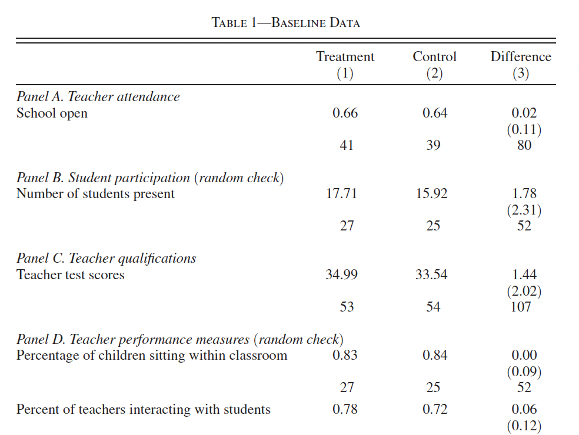
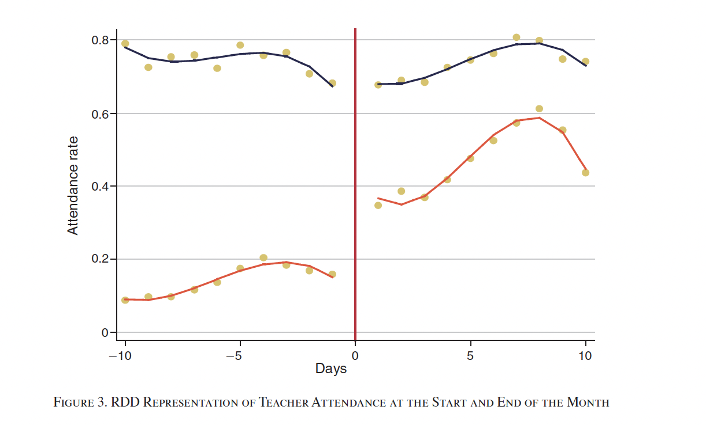

## What Is an Experiment?

::: incremental
-   Any research design where the **researcher controls the assignment of the treatment**

    -   A **randomized experiment** assigns treatment through some random procedure

-   If treatment is randomized, any difference in outcomes between groups can be attributed to a **causal effect**

-   This is counterintuitive. You might think that having control over who gets a program would be better for studying it. But the opposite is true. Giving up control over assignment is exactly what lets you make causal claims.
:::

## Why Experiments Work

Experiments are considered the "gold standard" for causal inference. Everything else we learn this semester is about trying to approximate what an experiment gives you for free.

. . .

::: callout-note
## Connecting to Last Week

Remember the **independence assumption**: $(Y^1, Y^0) \perp D_i$. Randomization guarantees this. If treatment is independent of potential outcomes, then the simple difference in means **is** the ATE. No need to worry about selection bias or confounders.
:::

## Why Should MPAs Care?

::: incremental
-   Program evaluations increasingly require experimental or quasi-experimental evidence

-   Federal agencies (Education, HHS, Labor) now prefer RCTs for grant applications

-   Understanding experimental design helps you **evaluate evidence** in policy reports, even if you never run one yourself

-   When you are handed an evaluation report, you need to know whether the evidence is any good
:::

## Types of Experiments {.smaller}
::: {.incremental}
-   **Lab Experiments:** Controlled settings, often involving games or tasks

    -   High internal validity, but may not reflect the real world

-   **Field Experiments / RCTs:** Real-world interventions with random assignment

    -   High external validity, but expensive and less control

-   **Survey Experiments:** Experimental treatments embedded in surveys

    -   Cheapest; but questions about whether survey responses match real behavior

-   **Natural Experiments:** Nature provides "as-if random" treatment assignment

    -   Lotteries, arbitrary cutoffs, historical accidents. Note that this last category is different from the others. Nobody designs a natural experiment. The researcher just notices that something in the world happened to create useful variation.
:::

## The Core Tradeoff

**Internal Validity:** Did the experiment actually measure what it claims to measure? Are the treatment and control groups truly comparable? Is the outcome measured correctly?

. . .

**External Validity:** Do the results apply beyond this specific study? If a program worked in rural India, would it work in South Carolina? If people said something in a survey, would they actually do it in real life?

. . .

These two goals are often in tension. Lab experiments give you tight control (high internal validity) but may not reflect the real world (lower external validity). Field experiments are messier but more realistic.

## Today's Roadmap

::: incremental
1.  **Ethics** — what we owe experimental subjects
2.  **Designing an experiment** — from recruitment to analysis
3.  **Power analysis** — making sure your study can detect real effects
4.  **Pre-registration** — finalizing your analysis before seeing results
5.  **Field and survey experiments** — with detailed examples
6.  **Looking ahead** — what comes next when experiments are not possible
:::

# Part 1: Ethics of Experiments

## Tuskegee Syphilis Study

::: incremental
-   Between 1932 and 1972, the U.S. Public Health Service ran a study on untreated syphilis in Macon County, Alabama

-   Researchers recruited 399 Black men who had syphilis and 201 who did not. Subjects were told they were receiving free treatment for "bad blood"

-   In reality, they received no treatment at all. Researchers wanted to observe how the disease progressed over time. Even after penicillin became the standard cure in the 1940s, subjects were denied it.

-   By the time a whistleblower exposed the study in 1972, at least 128 subjects had died of syphilis or its complications
:::

## Tuskegee: The Aftermath {.smaller}

::: incremental
-   In 1974, Congress passed the **National Research Act**, which created the framework for modern research ethics in the United States

-   The Act led to the **Belmont Report** (1979), which established three core principles: respect for persons, beneficence, and justice

-   It also required every institution that receives federal funding to maintain an **Institutional Review Board** (IRB) to oversee human subjects research

-   The study's legacy extends beyond research ethics. It contributed to deep and lasting mistrust of medical institutions among Black Americans, a pattern that researchers and public health officials still grapple with today
:::

## Milgram Obedience Experiments {.smaller}

Psychologist Stanley Milgram wanted to study obedience to authority in light of WW2 atrocities.

. . .

**Design:** Participants were told they were in a study about learning and memory. Each was instructed to administer electric shocks to "students" (actually paid actors) for wrong answers.

. . .

As voltage increased, actors screamed in pain, but the experimenter insisted participants continue. The majority continued through the maximum voltage.

. . .

Some participants suffered lasting psychological trauma. This case is important for research ethics because the harm was psychological, not physical, and because participants did not know what they were actually being studied for. Most modern ethics debates about deception in research trace back to experiments like this one.

## Informed Consent {.smaller}

::: incremental
-   Subjects should be made as aware of the **purpose of the experiment as possible**

-   **Deception** (telling subjects something false) should be kept to the feasible minimum; if used, provide a debrief afterward. 
    - Most policy experiments involve **incomplete disclosure** (not telling subjects everything)  rather than outright deception. A job training RCT does not lie to anyone, but control group members may not fully understand that they are being studied as a comparison.

-   Participants must be informed of **potential risks**

-   Researchers must provide documentation of these factors plus contact information, and **obtain informed consent** (usually via signature)
:::

## The IRB Process

::: incremental
-   Clemson's Institutional Review Board: <https://www.clemson.edu/research/division-of-research/offices/orc/irb/>

-   IRBs exist to protect participants and the university from liability

    -   Not there to make your life easier, but an important part of the process

-   Before collecting **any data with human subjects**, you must get IRB approval

    -   Does not apply to using existing census or survey data, only if you're collecting new data (or rare other cases)
:::

## When Is Randomization Ethical?

::: incremental
-   One common situation: a program is **oversubscribed** and resources are limited

-   In these cases, **lotteries** or random draws assign individuals to treatment or control

    -   Example: Access to newly constructed affordable housing determined by lottery among eligible applicants

-   This is both fair (everyone has an equal chance) and scientifically useful (randomization allows causal inference)
:::

## "Why Can't We Just Give It to Everyone?" {.smaller}

::: incremental
-   Stakeholders and policymakers often push back on randomization: if we think the program works, why withhold it from the control group?

-   The answer is that we do not yet *know* it works. That is the whole point of running the study.

-   Giving an unproven program to everyone might waste limited resources, or in some cases, the program might actually cause harm

-   There is a long history of well-intentioned interventions that turned out to be ineffective or counterproductive once rigorously tested. Let's look at a case study.

-   Randomization is how we find out what works before we scale it up
:::

## Scared Straight: A Case Study {.smaller}

::: incremental
-   In the 1970s, a program called "Scared Straight" brought juvenile offenders into prisons to meet inmates and see the reality of incarceration firsthand

-   The idea was intuitive: show kids where they'll end up if they keep breaking the law, and they'll be 'scared straight'

-   A 1978 documentary about the program at Rahway State Prison in New Jersey won an Academy Award. It claimed a 94% success rate among the kids who went through the program

-   Policymakers loved it. The program spread rapidly across the United States and internationally. By the 1990s, versions of it were running in dozens of states
:::

## Why Everyone Believed It Worked {.smaller}

::: incremental
-   The 94% success rate came from a simple before-and-after comparison: most kids who went through the program did not reoffend afterward

-   What is the counterfactual? What would have happened to those same kids if they had *not* gone through the program?

-   Most juvenile offenders age out of crime on their own. Many of the kids in the program were first-time offenders who were unlikely to reoffend regardless

-   Without a control group, there was no way to separate the effect of the program from the natural decline in offending that happens with age

-   The 94% number was not evidence that the program worked. It was evidence that most kids stop getting in trouble as they become adults
:::

## What the Experiments Actually Showed {.smaller}

::: incremental
-   Starting in the 1960s, researchers ran nine randomized controlled trials of Scared Straight and similar programs across eight US states

-   In each study, eligible youth were randomly assigned to either attend the program or to a control group that received no intervention

-   The results were surprising: across all nine studies, the kids who went through the program were *more* likely to reoffend than the control group

-   A meta-analysis by Petrosino et al. (2013) found that the programs increased offending by somewhere between 1% and 28% compared to doing nothing at all

-   One explanation is that exposing at-risk youth to hardened criminals, prison culture, and aggressive confrontation actually normalized criminal behavior rather than deterring it
:::

## Lessons for Public Administrators {.smaller}

::: incremental
-   Scared Straight is not an unusual case. Many popular programs have turned out to be ineffective or harmful when subjected to rigorous evaluation. D.A.R.E. is another well-known example

-   The program was adopted because the logic seemed sound, the anecdotes were compelling, and the before-and-after numbers looked impressive

-   But none of that is a substitute for a well-designed study with a credible counterfactual

-   As public administrators, you will regularly encounter programs with enthusiastic advocates, compelling stories, and no rigorous evidence. Your job is to ask the harder question: compared to what?
:::

# Part 2: Designing an Experiment

## Example: Does After-School Tutoring Improve Math Scores? {.smaller}

::: incremental
-   A school district wants to know whether an after-school tutoring program improves math scores for struggling students

-   They have funding for 100 slots but 200 eligible students. Because they cannot serve everyone, they can randomize who gets access.

-   **Recruitment (n = 200):**

    -   Inclusion: Students scoring below the 40th percentile on the state math assessment
    -   Exclusion: Students already receiving other academic interventions (e.g., special education pull-out services)
    -   Why these criteria? We want students who could plausibly benefit, without contaminating the treatment with other programs
:::

## Treatment Assignment {.smaller}

::: incremental
-   **Treatment group (n = 100):** Access to the tutoring program, two sessions per week for one semester

    -   **Treatment monotonicity:** Offering someone tutoring will not make them *less* likely to study. Access can only help or have no effect.

-   **Control group (n = 100):** Continue with their normal school day. No tutoring access during the study period.

    -   **Hawthorne effect:** Do control group parents seek out private tutoring because their child did not get the slot? Do control group students study harder because they know they are being observed? These are real threats in education RCTs.
:::

## What to Measure

::: incremental
-   **Treatment:** Offered access to tutoring (0/1)

-   **Primary outcome:** End-of-year score on the state math assessment

-   **Secondary outcomes:** Course grades, attendance, whether the student is held back

    -   If measuring multiple outcomes, need to adjust for multiple hypothesis testing

-   **Covariates:** Optional! Randomization already gives us balance between treatment and control
:::

## But Who Actually Shows Up?

::: incremental
-   We offered tutoring to 100 students. But not all of them will come.

-   Some students assigned to tutoring never attend a single session. Maybe they have transportation problems, or after-school jobs, or they just do not want to go.

-   Meanwhile, some students in the control group might find tutoring on their own from a parent, an older sibling, or a paid tutor.

-   This creates a gap between what we *assigned* and what students actually *did*.
:::

## Compliance Types {.smaller}

There are four types of people in any experiment, defined by what they would do under each assignment:

. . .

**Compliers:** Students who attend tutoring if offered, and do not seek it out if not offered. These are the students whose behavior is actually changed by the experiment.

. . .

**Always-takers:** Students who would get tutoring regardless of assignment. If offered the program they attend; if not offered, their parents hire a private tutor.

. . .

**Never-takers:** Students who will not attend tutoring no matter what. Even if offered a slot, they never show up.

. . .

**Defiers:** Students who do the opposite of their assignment. These are rare and most designs assume they do not exist.

## Why Compliance Matters {.smaller}

::: incremental
-   We cannot observe which type each student is. We only see what they were assigned and what they did.

-   This means the experiment answers a slightly different question than we might want

-   **Intent-to-treat (ITT):** What is the effect of *offering* tutoring? This compares everyone assigned to treatment against everyone assigned to control, regardless of whether they showed up. This is what the simple difference in means gives you.

-   **Treatment-on-the-treated (TOT):** What is the effect of *actually receiving* tutoring? This is harder to estimate because the students who show up are probably different from those who do not.

-   The ITT is the safer estimate. It answers the question a policymaker actually faces: "If I offer this program, what happens on average?"
:::

## Analysis: The ATE as a Difference in Means

In an experiment, the ATE is simply the difference in average outcomes between groups:

$$ATE = E[Y | D = 1] - E[Y | D = 0]$$

::: callout-note
## In Plain Language

Average outcome for the treatment group minus average outcome for the control group. Because treatment was randomly assigned, this simple comparison gives you the causal effect directly. With non-compliance, this estimates the ITT: the effect of being *offered* the program.
:::

## Simulating the Experiment in R {.smaller}

```{r}
#| echo: true

library(tidyverse)
set.seed(30317)

n_per_group <- 100
n <- n_per_group * 2

# Random assignment: 100 control, 100 treatment
assigned <- sample(c(rep(0, n_per_group), rep(1, n_per_group)))

# Pre-treatment covariates
baseline_score <- rnorm(n, mean = 35, sd = 8)   # baseline math percentile
free_lunch <- rbinom(n, 1, 0.6)                  # free/reduced lunch
grade <- sample(6:8, n, replace = TRUE)           # grade level

# Not everyone assigned to treatment actually attends
# About 75% of those offered tutoring actually show up
attended <- ifelse(assigned == 1, rbinom(n, 1, 0.75), 0)

# Outcome: end-of-year math score
# Tutoring has a real effect of about 5 points for those who attend
endyear_score <- baseline_score + 10 +
  0.3 * baseline_score - 2 * free_lunch +
  5 * attended +
  rnorm(n, 0, 6)

df <- data.frame(id = 1:n, assigned, attended,
                 baseline_score, free_lunch, grade, endyear_score)
```

## Balance Check {.smaller}

Before looking at outcomes, verify that randomization produced similar groups:

```{r}
#| echo: true

# Compare covariate means across groups
df %>%
  group_by(assigned) %>%
  summarise(
    avg_baseline = mean(baseline_score),
    pct_free_lunch = mean(free_lunch),
    avg_grade = mean(grade)
  )
```

. . .

Or more formally:

```{r}
#| echo: true
#| eval: false

t.test(baseline_score ~ assigned, data = df)
t.test(free_lunch ~ assigned, data = df)
```

If there are significant differences, you can control for the covariate, but it also suggests your randomization may have gone wrong!

## The Intent-to-Treat Estimate {.smaller}

```{r}
#| echo: true

# ITT: compare by assignment, regardless of attendance
t.test(endyear_score ~ assigned, data = df)
```

. . .

::: callout-important
This estimates the effect of *offering* tutoring. It includes the never-takers who dragged the treatment group average down. The true effect on students who actually attended is larger.
:::

## ITT vs. Naive TOT {.smaller}

```{r}
#| echo: true

# Naive TOT: compare attenders vs. non-attenders (BIASED!)
df %>%
  group_by(attended) %>%
  summarise(avg_score = mean(endyear_score), n = n())
```

. . .

::: callout-warning
This is **not** a valid causal estimate. Students who showed up to tutoring are probably more motivated, have more parental support, etc. Comparing attenders to non-attenders reintroduces selection bias. This is exactly the problem randomization was supposed to solve.
:::

## Should We Include Covariates? {.smaller}

::: incremental
-   **Arguments for** including covariates in a regression:
    -   Increases precision and statistical power
    -   Accounts for any residual imbalance
    -   Allows exploration of heterogeneous effects
-   **Arguments against:**
    -   Simplicity of interpretation is better without covariates
    -   Randomization already handles confounding
    -   Overfitting risk with small samples
:::

## My Take

::: incremental
-   Pick your approach in the **pre-registration** and stick to it

    -   You lose credibility if you switch your analysis strategy after seeing results

-   Generally, I prefer the simple t-test, even at the cost of some power

    -   But either approach is fine

-   If you have strong reason to suspect covariates matter, regression can help detect heterogeneous effects
:::

## Regression With Covariates {.smaller}

```{r}
#| echo: true

model_with <- lm(endyear_score ~ assigned + baseline_score + free_lunch + grade, data = df)
summary(model_with)
```

## Compare: Regression Without Covariates {.smaller}

```{r}
#| echo: true

model_without <- lm(endyear_score ~ assigned, data = df)
summary(model_without)
```

. . .

Notice how the standard error on `assigned` shrinks when we include covariates, especially baseline score. Controlling for where students started gives us a more precise estimate of how much the program moved them.

# Part 3: Power Analysis

## Selecting a Sample Size {.smaller}

::: incremental
-   **Statistical power** is the probability that your test will correctly reject the null hypothesis when a real effect exists

-   Before running an experiment, you need to ensure you have enough power to detect an effect of a reasonable size

    -   "Reasonable" should be defined by theory and prior work, not by what's convenient

-   **Key terms:**

    -   **Significance (**$\alpha$): Probability of a false positive. Usually set at 0.05.
    -   **Power (**$1 - \beta$): Usually set at 0.80 (meaning a 20% chance of missing a real effect)
    -   **Minimum Detectable Effect (MDE):** The smallest effect you can reliably detect given your sample size
:::

## What Increases Power?

::: incremental
-   **Larger sample size** → more power, smaller MDE

-   **Lower outcome variance** → more power (less noise)

-   **Larger true effect** → easier to detect

-   **Equal allocation** between treatment and control → most efficient use of your sample
:::

## Visualizing Power {.smaller}

```{r}
#| echo: false

library(ggplot2)

mu0 <- 0
mu1 <- 2
sd <- 1
alpha <- 0.05
z_alpha <- qnorm(1 - alpha, mean = mu0, sd = sd)
x <- seq(-4, 6, length.out = 1000)

df_power <- data.frame(
  x = rep(x, 2),
  density = c(dnorm(x, mean = mu0, sd = sd),
              dnorm(x, mean = mu1, sd = sd)),
  group = rep(c("H0", "H1"), each = length(x))
)

colors <- c("H0" = "#E74C3C", "H1" = "#1ABC9C")

ggplot(df_power, aes(x = x, y = density, color = group)) +
  geom_line(size = 1) +
  scale_color_manual(values = colors) +
  geom_vline(xintercept = z_alpha, linetype = "dashed", color = "goldenrod", size = 1) +
  geom_vline(xintercept = mu0, color = "#E74C3C", size = 0.5) +
  geom_vline(xintercept = mu1, color = "#1ABC9C", size = 0.5) +
  annotate("text", x = mu0 - 0.2, y = 0.35, label = "H[0]", parse = TRUE, color = "#E74C3C", size = 5) +
  annotate("text", x = mu1 + 0.2, y = 0.35, label = "H[1]", parse = TRUE, color = "#1ABC9C", size = 5) +
  annotate("text", x = mu0, y = -0.01, label = "0") +
  annotate("text", x = mu1, y = -0.01, label = "beta", parse = TRUE) +
  geom_area(data = subset(df_power, group == "H1" & x > z_alpha),
            aes(x = x, y = density), fill = "darkseagreen1", alpha = 0.6, inherit.aes = FALSE) +
  theme_minimal() +
  labs(x = NULL, y = NULL, color = NULL) +
  theme(legend.position = c(0.85, 0.85),
        axis.text.y = element_blank(),
        axis.ticks.y = element_blank())
```

The green shaded area is your **power**: the probability of correctly detecting the effect. If the true effect is small or your sample is small, this area shrinks. Think of it this way: a small effect means the two curves nearly overlap, and it becomes very hard to tell them apart.

## The MDE Formula {.smaller}

Given a fixed sample size, the minimum detectable effect is:

$$MDE = (t_{1-\beta} + t_{\alpha/2})\sqrt{\frac{1}{P(1-P)}} \times \frac{\sigma}{\sqrt{N}}$$

The intuition is straightforward. Look at the right side of the formula and notice what makes the MDE smaller (i.e., lets you detect smaller effects):

. . .

-   **Bigger sample** ($N$ is in the denominator, so more observations shrinks the MDE)
-   **Less noisy outcomes** ($\sigma$ is in the numerator, so less variation in your outcome makes effects easier to spot)
-   **Equal treatment/control splits** ($P = 0.5$ minimizes $P(1-P)$, so a 50/50 split is the most efficient use of your sample)

. . .

You can also flip this formula around: pick the smallest effect you care about detecting, and solve for the sample size you need. In practice, most people use software to do this (R's `pwr` package, for instance).

## Connecting This to Our Tutoring Example {.smaller}

Suppose prior research suggests tutoring programs improve math scores by about 3 to 5 points on the state test. The standard deviation of math scores in the district is about 15 points. We have 100 students per group. Let's plug in the numbers:

```{r}
#| echo: true

# Our study parameters
N <- 200          # total sample (100 per group)
P <- 0.5          # 50/50 split
sigma <- 15       # SD of math scores
t_power <- 0.84   # t-value for 80% power
t_alpha <- 1.96   # t-value for 5% significance (two-sided)

MDE <- (t_power + t_alpha) * sqrt(1 / (P * (1 - P))) * (sigma / sqrt(N))
round(MDE, 1)
```

. . .

Our MDE is about `r round(MDE, 1)` points. That means we can only detect effects of roughly 6 points or larger. If the true effect is 3 points (the low end of what prior research suggests), this study will miss it most of the time. We would either need a bigger sample or a less noisy outcome measure.

## What If We Had More Students? {.smaller}

```{r}
#| echo: true

# Try different sample sizes
sample_sizes <- c(100, 200, 400, 600, 1000)
mdes <- (t_power + t_alpha) * sqrt(1 / (P * (1 - P))) * (sigma / sqrt(sample_sizes))

data.frame(
  `Total N` = sample_sizes,
  `Per Group` = sample_sizes / 2,
  MDE = round(mdes, 1)
)
```

. . .

To detect a 3-point effect, we would need about 800 students total (400 per group). This is why power analysis matters: running a study that is too small wastes everyone's time and money.

## Type S and Type M Errors {.smaller}

Small samples create two underappreciated problems beyond low power:

. . .

**Type S (Sign) Error:** The probability that your estimated effect has the **wrong sign**. You find a positive effect when the truth is negative, or vice versa.

. . .

**Type M (Magnitude) Error:** The **exaggeration ratio**. How much your significant estimates overstate the true effect. In small samples, only the most extreme estimates pass the significance threshold.

## Example: Why This Matters {.smaller}

::: incremental
-   Imagine the true effect of the tutoring program is **+3 points** on the math test

-   In a study with only 30 students per group, you might estimate **+12 points** with p = 0.04

    -   Looks great. A big effect and statistically significant.

    -   But it is a **Type M error**: the estimate is 4x the truth. If the district scales up the program expecting 12 points of improvement, they will be disappointed.

-   Run the same small study again and you might get **-4 points**

    -   A **Type S error**: you concluded tutoring *hurts* math scores when it actually helps

-   The traditional focus on p-values and Type I error completely misses these problems. This is why power analysis matters before you collect any data.
:::

# Part 4: Pre-Registration

## Why Pre-Register? {.smaller}

::: incremental
-   One advantage of experiments is that they are harder to p-hack or fish for significance

    -   Limits "researcher degrees of freedom"

-   But you could still collect many outcomes and run multiple tests until you find something significant

    -   This is a real problem. If you measure math scores, reading scores, attendance, grades, and behavioral referrals, the odds of finding *something* significant by chance go up fast.

-   When you read an evaluation report, one of the first things to check is whether the analysts committed to their approach ahead of time. If they did not, you should be more skeptical of the results.
:::

## Pre-Registration in Practice {.smaller}

::: incremental
-   Organizations that fund or review program evaluations increasingly expect pre-analysis plans

    -   The What Works Clearinghouse (IES) gives higher ratings to studies with pre-registered designs
    -   J-PAL and MDRC, two of the largest evaluation organizations, require pre-analysis plans for their RCTs
    -   Major foundations (Arnold Ventures, Gates Foundation) expect them as part of grant applications

-   The Foundations for Evidence-Based Policymaking Act (2018) requires federal agencies to develop evaluation plans and use rigorous evidence. Pre-registration is part of that culture.


:::

## What Goes in a Pre-Analysis Plan {.smaller}

::: incremental
-   Complete information on the experimental design: treatments, recruitment, etc.

-   Complete information on what will be measured

-   Complete information on what analyses will be run and hypotheses tested

    -   Deviations from the plan are OK if transparent, but try to avoid them

-   For our tutoring study, the plan would specify that we are comparing end-of-year math scores by assignment using a t-test, and that we will also look at attendance and grades as secondary outcomes.

-   Example of a real pre-analysis plan: <https://osf.io/prk2t/?view_only=bf72ec263e764bab82a3c9817f96f84d>
:::

## Assignment Strategies {.smaller}

::: incremental
-   **Complete randomization** (coin flips) can produce unbalanced groups, especially in small samples

    -   You could even end up with everyone in one group!

-   **Controlled assignment:** Set quotas for group sizes, then randomly assign within those quotas

-   **Stratified assignment:** Group individuals by theoretically important characteristics, then randomize within each stratum
:::

. . .

```{r}
#| echo: false

library(gt)

data.frame(
  `Lunch Status` = c("Free/Reduced", "Full Price"),
  Treatment = c(30, 20),
  Control = c(30, 20)
) %>%
  gt() %>%
  tab_header(title = "Stratified Randomization Example")
```

. . .

Without stratification, you might end up with 40 free-lunch students in treatment and only 20 in control. Most important if you care about the effects on some small subgroup
# Part 5: Case Study: Incentives Work (Duflo, Hanna, and Ryan 2012)

## Incentives Work: Getting Teachers to Come to School {.smaller}

::: incremental
-   **Background:** Teacher absenteeism is a major problem in rural India. Educational outcomes are poor.

    -   Seva Mandir runs single-teacher schools in rural India

    -   They try to minimize absenteeism by "berating" absent teachers — yet absenteeism remains high

-   **Question:** Can policymakers design an intervention to incentivize better teacher attendance?

    -   **Secondary Question:** Does higher teacher attendance improve student outcomes?
:::

## The Intervention {.smaller}

::: incremental
-   Seva Mandir runs single-teacher nonformal education centers (NFEs) in rural villages in Rajasthan. These are not government schools, and the teachers are "para-teachers" on short, renewable contracts, not civil servants

-   At baseline (August 2003), the teacher absence rate was about **35 percent**. Teachers were paid a flat Rs. 1,000 per month regardless of attendance. Seva Mandir tried to reduce absences by threatening dismissal, but this was not enforced

-   In September 2003, teachers in **57 randomly selected schools** were given tamper-proof cameras with date and time stamps. A student took a photo of the teacher and classmates at the start and end of the day

-   A "valid" day required that the two photos were at least **five hours apart** and both showed **at least eight children** present

-   Pay in treatment schools was tied to attendance: Rs. 500 for the month if the teacher attended fewer than 10 days, plus Rs. 50 for each additional day beyond 10. The **56 comparison schools** kept the flat Rs. 1,000 monthly pay
:::

## Why This Design Is Clever

::: incremental
-   The cameras solve the **monitoring problem**. Unannounced visits are expensive and infrequent. The camera gives daily, verifiable data on attendance at low cost

-   The nonlinear pay structure is designed so that teachers who barely show up get a pay cut (Rs. 500 instead of Rs. 1,000), while teachers who attend regularly earn more than before (20 days at Rs. 50 each above 10 = Rs. 1,000 bonus on top of Rs. 500 = Rs. 1,500 total)

-   The five-hour and eight-student rules prevent gaming. You cannot just show up, snap a photo, and leave

-   Is this ethical? What are the considerations? Note that these are para-teachers on renewable contracts, not government employees with union protections
:::

## Preview of Results

::: incremental
-   Teacher attendance **increased significantly** in treatment schools

-   Test scores improved by about **0.2 standard deviations**

    -   A modest but detectable effect

-   After 2.5 years, children in the program were **62% more likely** to transfer to formal primary schools
:::

## Design Details

::: incremental
-   Duflo and co-authors partnered with Seva Mandir — a very common approach for field experiments

    -   Sometimes a way to find funding: provide free analysis for an NGO

-   120 total schools, randomized. Some **attrition**: 3 treatment schools and 4 control schools closed during the study.
:::

## Treatment Details

::: incremental
-   Initial teacher wage: Rs. 1,000 (\~\$160 PPP) for a minimum of 20 days of work

    -   Treatment: Rs. 50 bonus (\~\$8 PPP) for each day over 20; Rs. 50 fine for each day under 20, fines capped at Rs. 500

-   Control group receives the initial wage with no incentive structure

-   Teachers reminded they could be dismissed for poor attendance

    -   But no teacher was actually fired during the evaluation. Why not?
:::

## Data Collection {.smaller}

::: incremental
-   Study done with J-PAL, one of the main funders of field experiments. They handled data collection.

-   Teacher attendance measured through **two unannounced visits per month:**

    -   How many students present? Anything on the blackboard? Was the teacher talking to children?
    -   Why are these good measures?

-   Seva Mandir provided camera and payment data

-   Three student exams administered: pretest, midtest, post-test

    -   Basic math and vocabulary
    -   Students who could not write received 0 on written portions
:::

## Baseline Data

{fig-align="center"}

## Baseline Balance

::: incremental
-   Similar proportions of students (17% treatment vs 19% control) took the written exam

-   Control group scored slightly higher on the oral exam; treatment slightly higher on written

    -   Neither difference close to significant — randomization worked!
:::

## Results: Attendance

{fig-align="center"}

This is simply the difference in the percentage of schools open when randomly checked. Because treatment was randomized, this comparison is all you need.

## Results: Magnitudes

::: incremental
-   Attendance was **79%** for treatment teachers vs **58%** for control

    -   Difference of 0.21, SE = 0.03, p-value well under 0.05

-   Standard errors clustered by school (since treatment assigned at school level)

    -   The choice of inference method should be specified in the pre-registration
:::

## The Incentive Structure in Action

{fig-align="center"}

Black line = teachers already "in the money." Red line = teachers not yet at the threshold. What does this tell us about how incentives work?

## Discussion

::: incremental
-   What are the **precise treatment effects** measured here?

    -   I count at least three distinct effects in this study. Think about the camera, the financial incentive, and the threat of dismissal.

-   Are there potential threats to **internal validity**?

-   What about **external validity**? Where might these results generalize? Where should we be skeptical?
:::

## What Happened Next?

::: incremental
-   Seva Mandir adopted the camera-based monitoring system across its schools after the evaluation ended

-   The study became one of the most cited examples of how financial incentives can improve public service delivery in developing countries

-   But note the external validity question: would the same incentive structure work for teachers in the U.S., where wages are higher and monitoring systems already exist? The answer is not obvious.
:::

## Field Experiments: Pros and Cons {.smaller}

::: incremental
-   **Benefits:** High external validity. Involves real interventions with real consequences for real people.

-   **Drawbacks:** Less control over treatments. More potential for internal validity issues. Reliance on partner organizations. Expensive, though funding exists.

-   **Resources:**

    -   <https://www.povertyactionlab.org/research-resources?view=toc>
    -   <https://www.povertyactionlab.org/page/handbook-field-experiments>
    -   Work with faculty! We have experience applying for grants and may lend credibility to applications
:::

# Part 6: Survey Experiments

## Why Survey Experiments?

::: incremental
-   Embed experimental treatments directly in surveys

-   Obvious limitations: restricted to text, images, and (if interactive) videos or web apps

-   The **cheapest** way to run an experiment

-   Being embedded in a survey lets you collect lots of background data on respondents

-   External validity is the main concern: do survey responses match real behavior?

-   Mechanics: code in Qualtrics (free through Clemson), pay for a sample. If you are serious about this, come talk to me.
:::

## Conjoint Experiments

::: incremental
-   Many policy-relevant decisions are **multidimensional**

    -   What features of a program matter most to potential participants? What drives enrollment? What drives satisfaction?

-   It would be nice to vary **many dimensions simultaneously and randomly**, and figure out which ones actually matter

-   This is what **conjoint experiments** do. Respondents see two profiles side by side, with attributes randomly assigned, and choose one. Because the profiles are random, any systematic preference reveals a causal effect.
:::

## Example: Designing a Job Training Program {.smaller}

A workforce development agency wants to know which features of a training program matter most to potential participants. They survey 500 adults who are eligible for the program.

. . .

Each respondent sees pairs of hypothetical programs and picks the one they would be more likely to enroll in. The attributes are randomly varied:

::: incremental
-   **Duration:** 4 weeks, 8 weeks, 16 weeks
-   **Format:** In-person, Online, Hybrid
-   **Childcare provided:** Yes, No
-   **Transportation stipend:** Yes, No
-   **Credential:** None, Certificate of completion, Industry certification
-   **Schedule:** Daytime, Evening, Weekend
:::

## A Conjoint Profile

| Attribute         | Program A              | Program B   |
|-------------------|------------------------|-------------|
| Duration          | 8 weeks                | 16 weeks    |
| Format            | Hybrid                 | In-person   |
| Childcare         | Yes                    | No          |
| Transport stipend | Yes                    | No          |
| Credential        | Industry certification | Certificate |
| Schedule          | Evening                | Daytime     |

The respondent picks one. Because profiles are **randomly generated**, any systematic preference for one attribute level over another is a causal effect.

## What Can We Learn From This? .{smaller}

::: incremental
-   The **Average Marginal Component Effect (AMCE)** tells you: holding all other attributes at their randomly assigned values, how much does changing one attribute change the probability that a program is chosen?

-   For example: "Offering childcare increases the probability that a program is chosen by 12 percentage points, compared to not offering childcare."

-   Because the profiles are fully randomized, you can estimate these effects with a simple regression. Each attribute gets its own coefficient, just like a regular regression model.

-   This gives the agency direct guidance on where to spend limited resources. If childcare matters more than schedule flexibility, that tells you something concrete about program design.
:::

## Simulating a Conjoint in R {.smaller}

```{r}
#| echo: true

set.seed(30317)
n_resp <- 500
n_tasks <- 5  # each respondent sees 5 pairs
n_rows <- n_resp * n_tasks * 2  # two profiles per task

conjoint_df <- tibble(
  respondent = rep(1:n_resp, each = n_tasks * 2),
  task = rep(rep(1:n_tasks, each = 2), n_resp),
  profile = rep(c("A", "B"), n_resp * n_tasks),
  duration = sample(c("4 weeks", "8 weeks", "16 weeks"), n_rows, replace = TRUE),
  format = sample(c("In-person", "Online", "Hybrid"), n_rows, replace = TRUE),
  childcare = sample(c("Yes", "No"), n_rows, replace = TRUE),
  transport = sample(c("Yes", "No"), n_rows, replace = TRUE),
  credential = sample(c("None", "Certificate", "Industry cert"), n_rows, replace = TRUE),
  schedule = sample(c("Daytime", "Evening", "Weekend"), n_rows, replace = TRUE)
)
```

## Simulating Choices {.smaller}

```{r}
#| echo: true

# Generate utility for each profile based on attribute effects
conjoint_df <- conjoint_df %>%
  mutate(
    utility =
      -0.10 * (duration == "16 weeks") +
       0.05 * (duration == "4 weeks") +
      -0.08 * (format == "Online") +
       0.03 * (format == "Hybrid") +
       0.12 * (childcare == "Yes") +
       0.07 * (transport == "Yes") +
       0.15 * (credential == "Industry cert") +
       0.05 * (credential == "Certificate") +
      -0.04 * (schedule == "Weekend") +
       0.02 * (schedule == "Evening") +
      rnorm(n_rows, 0, 0.3)
  )

# Within each task, the profile with higher utility is chosen
conjoint_df <- conjoint_df %>%
  group_by(respondent, task) %>%
  mutate(chosen = as.integer(utility == max(utility))) %>%
  ungroup()
```

## Estimating the AMCE {.smaller}

```{r}
#| echo: true

# Simple linear probability model
amce_model <- lm(chosen ~ duration + format + childcare +
                   transport + credential + schedule,
                 data = conjoint_df)
summary(amce_model)
```

## Plotting the Results {.smaller}

```{r}
#| echo: false

library(ggplot2)
library(broom)

amce_results <- tidy(amce_model, conf.int = TRUE) %>%
  filter(term != "(Intercept)") %>%
  mutate(
    attribute = case_when(
      grepl("duration", term) ~ "Duration",
      grepl("format", term) ~ "Format",
      grepl("childcare", term) ~ "Childcare",
      grepl("transport", term) ~ "Transport",
      grepl("credential", term) ~ "Credential",
      grepl("schedule", term) ~ "Schedule"
    ),
    level = gsub("duration|format|childcare|transport|credential|schedule", "", term),
    term_label = paste0(attribute, ": ", level)
  )

ggplot(amce_results, aes(x = estimate, y = reorder(term_label, estimate))) +
  geom_point(size = 3) +
  geom_errorbarh(aes(xmin = conf.low, xmax = conf.high), height = 0.2) +
  geom_vline(xintercept = 0, linetype = "dashed", color = "gray50") +
  labs(x = "Change in probability of being chosen",
       y = NULL,
       title = "Which program features drive enrollment?") +
  theme_minimal(base_size = 14)
```

## What Does This Tell the Agency? {.smaller}

::: incremental
-   The plot shows how much each attribute level changes the probability of a program being chosen, relative to a reference category

-   In our simulated data, **industry certification** and **childcare** are the biggest drivers of enrollment. Program duration and online format reduce interest.

-   This gives administrators concrete, evidence-based guidance: if you have limited budget, investing in childcare and a recognized credential will do more to boost enrollment than, say, offering weekend scheduling.

-   The key limitation remains external validity. People say they prefer childcare in a survey, but would they actually enroll? Survey responses and real behavior do not always match.
:::

## Looking Ahead: When Experiments Are Not Possible .{smaller}

::: incremental
-   Often in policy research, we **cannot** randomize the treatment. We cannot randomly assign poverty, or school quality, or exposure to pollution.

-   In these cases, we need designs that use **observational data** but get us closer to causal inference than a simple regression

-   Over the next few weeks we will cover three of these designs:

    -   **Fixed effects and panel data:** use repeated observations of the same units to control for things we cannot measure
    -   **Difference-in-differences:** compare trends before and after a policy change between affected and unaffected groups
    -   **Regression discontinuity:** exploit arbitrary cutoffs (age thresholds, test score cutoffs, geographic boundaries) where treatment is essentially random for people near the line
:::

# Wrapping Up

## What We Covered Today {.smaller}

::: incremental
1.  **Why experiments work**: randomization guarantees the independence assumption
2.  **Ethics**: informed consent, IRB, the legacy of Tuskegee and Milgram
3.  **Designing experiments**: from recruitment to analysis, with a tutoring program example
4.  **Compliance**: compliers, never-takers, and the difference between ITT and TOT
5.  **Power analysis**: making sure your study can detect the effect you care about
6.  **Pre-registration**: committing to your analysis plan before seeing results
7.  **Field experiments**: real-world interventions (Duflo teacher incentives)
8.  **Survey experiments**: conjoint analysis for program design
:::

## What's Next

::: incremental
-   **Fixed effects and panel data**: controlling for unobserved differences between units
-   **Difference-in-differences**: comparing trends before and after a policy change
-   **Regression discontinuity**: exploiting arbitrary cutoffs in policy rules
:::

## For Your Final Project

::: callout-tip
## Think About This Now

Could your research question benefit from experimental evidence? Even if you cannot run an experiment yourself, think about what an ideal experiment would look like. What would you randomize? Who would be in your sample? What would you measure? Thinking through the experimental ideal helps clarify what your observational analysis is trying to approximate.
:::